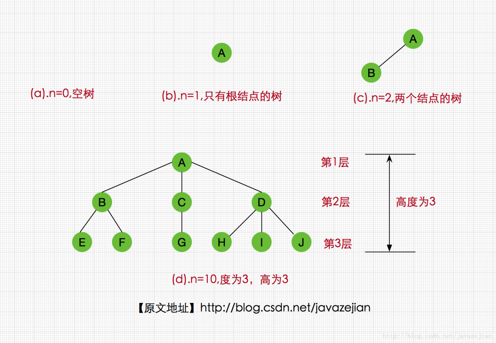
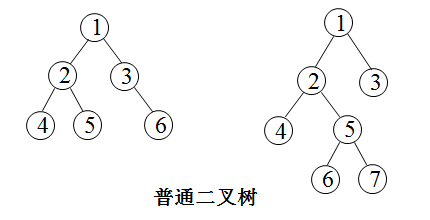
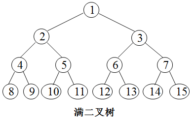
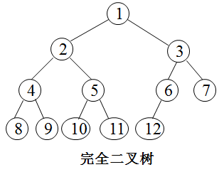
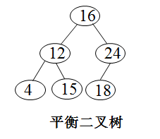
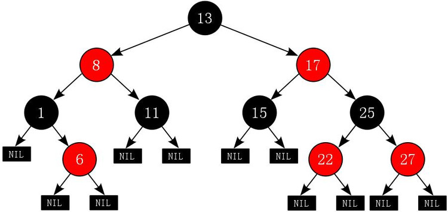

## 文章目录

- [一、简介说明](#一、简介说明)
- [二、数组](#二、数组)
- [三、链表](#三、链表)
    - [3.1-链表介绍](#3.1-链表介绍)
    - [3.2-数组与链表对比](#3.2-数组与链表对比)
- [四、堆栈](#四、堆栈)
- [五、队列](#五、队列)
- [六、树](#六、树)
    - [6.1 基础概念](#6.1-基础概念)
    - [6.2 二叉树](#6.2-二叉树)
    - [6.3 满二叉树](#6.3-满二叉树)
    - [6.4 完全二叉树](#6.4-完全二叉树)
    - [6.5 二叉查找、搜索、排序树](#6.5-二叉查找、搜索、排序树)
    - [6.6 平衡二叉树](#6.6-平衡二叉树)
    - [6.7 红黑树](#6.7-红黑树)
    - [6.8 B-树](#6.8-b-树)
    - [6.9 B+树](#6.9-b+树)
    - [6.10 B*树](#6.10-b*树)


### 一、简介说明
**数据结构：**
是指相互之间存在一种或多种特定关系的数据元素的集合。听起来是不是很抽象，
简单理解：数据结构就是描述对象间逻辑关系的学科。
比如：队列就是一种先进先出的逻辑结构，栈是一种先进后出的逻辑结构，家谱是一种树形的逻辑结构！

**数据存储结构：**
它是计算机的一个概念，简单讲，就是描述数据在计算机中存储方式的学科；
常用的数据存储方式就两种：顺序存储，非顺序存储！
- 顺序存储就是把数据存储在一块连续的存储介质（比如硬盘或内存）
  上—-举个例子：从内存中拿出第100个字节到1000个字节间的连续位置，存储数据；
  数组就是典型的顺序存储！
- 非顺序存储就是各个数据不一定存在一个连续的位置上，只要每个数据知道它前面的数据和后面的数据，
  就能把所有数据连续起来啦；链表就是典型的非顺序存储啦！

数组、链表、堆栈和队列是最基本的数据结构，任何程序都会涉及到其中的一种或多种。

下面简单描述一下数组、链表、堆栈、队列和二叉树

### 二、数组
数组是最最基本的数据结构，很多语言都内置支持数组。

数组是使用一块连续的内存空间保存数据，保存的数据的个数在分配内存的时候就是确定的：


上图为包含N个数据的数组

访问数组中第 n 个数据的时间花费是 O(1) ，但是要在数组中查找一个指定的数据则是 O(N)。
当向数组中插入或者删除数据的时候，最好的情况是在数组的末尾进行操作，时间复杂度是O(1) ，
但是最坏情况是插入或者删除第一个数据，时间复杂度是 O(N) 。
在数组的任意位置插入或者删除数据的时候，后面的数据全部需要移动，移动的数据还是和数据个数有关所以总体的时间复杂度仍然是 O(N) 。


上图为插入一个数据

**数组的局限性分析：**
1. 插入快，对于无序数组，上面我们实现的数组就是无序的，即元素没有按照从大到小或者某个特定的顺序排列，
   只是按照插入的顺序排列。无序数组增加一个元素很简单，只需要在数组末尾添加元素即可，但是有序数组却不一定了，
   它需要在指定的位置插入。
2. 对于无序数组来说，查找慢，当然如果根据下标来查找是很快的。但是通常我们都是根据元素值来查找，给定一个元素值，
   对于无序数组，我们需要从数组第一个元素开始遍历，直到找到那个元素。有序数组通过特定的算法查找的速度会比无需数组快，
   后面我们会讲各种排序算法。
3. 删除慢，根据元素值删除，我们要先找到该元素所处的位置，然后将元素后面的值整体向前面移动一个位置。也需要比较多的时间。
4. 数组一旦创建后，大小就固定了，不能动态扩展数组的元素个数。如果初始化你给一个很大的数组大小，那会白白浪费内存空间，
   如果给小了，后面数据个数增加了又添加不进去了。


### 三、链表
#### 3.1 链表介绍
链表是在非连续的内存单元中保存数据，并且通过指针将各个内存单元链接在一起，最有一个节点的指针指向 NULL 。
链表不需要提前分配固定大小存储空间，当需要存储数据的时候分配一块内存并将这块内存插入链表中。

在链表中查找第 n 个数据以及查找指定的数据的时间复杂度是 O(N) ，但是插入和删除数据的时间复杂度是 O(1) ，
因为只需要调整指针就可以：

下面是链表图：


下面是向链表中插入数据：


下面试从链表中删除数据：


向上面这样的链表结构在插入和删除的时候编程会比较困难，因为需要记住当前节点的前一个节点，这样才能完成插入和删除。

为了简便通常使用带有头节点的链表：


上面的链表是单链表，此外还有双链表，就是节点中包含指向下一个节点的指针和指向上一个节点的指针,如下图：


不带有头节点的双向链表在插入和删除数据的时候也不会出现单链表那样的问题。

此外还有一种链表是循环链表，它是将双向链表的头尾相接：


向循环双向链表和循环链表中插入或者从中删除数据只是多移动几个指针。

#### 3.2 数组与链表对比
| 维度       | 数组   |  链表  |
| --------   | -----:  | :----:  |
| 空间性能   | 顺序表的存储空间是静态分布的，需要一个固定的数组，总有部分数组元素要浪费  |   链表的存储空间是动态分布，因此不会有空间被浪费。但由于链表需要额外的空间来为每个节点保存指针，因此也要牺牲一部分空间    |
| 时间性能        |   顺序表中的元素的逻辑顺序和物理存储顺序保持一致，而且支持随机存取。因此顺序表在查找，读取时候效率很快  |   链表采用链式结构来保存表内的元素，因此在插入、删除的时候效率比较高   |
### 四、堆栈
堆栈实现了一种后进先出的语义 (LIFO) 。可以使用数组或者是链表来实现它：


对于堆栈中的数据的所有操作都是在栈的顶部完成的，只可以查看栈顶部的数据，只能够向栈的顶部压入数据，也只能从栈的顶部弹出数据

通过数组实现堆栈代码：
```java
public class MyStack {
	//底层实现是一个数组
	private long[] arr;
	private int top;
	/**
	 * 默认的构造方法
	 */
	public MyStack() {
		arr = new long[10];
		top = -1;
	}
	/**
	 * 带参数构造方法，参数为数组初始化大小
	 */
	public MyStack(int maxsize) {
		arr = new long[maxsize];
		top = -1;
	}
	/**
	 * 添加数据
	 */
	public void push(int value) {
		arr[++top] = value;
	}
	/**
	 * 移除数据
	 */
	public long pop() {
		return arr[top--];
	}
	/**
	 * 查看数据
	 */
	public long peek() {
		return arr[top];
	}
	/**
	 * 判断是否为空
	 */
	public boolean isEmpty() {
		return top == -1;
	}
	/**
	 * 判断是否满了
	 */
	public boolean isFull() {
		return top == arr.length - 1;
	}
}

/**测试类*/
public class TestMyStack {
	public static void main(String[] args) {
		MyStack ms = new MyStack(4);
		ms.push(23);
		ms.push(12);
		ms.push(1);
		ms.push(90);
		System.out.println(ms.isEmpty());
		System.out.println(ms.isFull());
		System.out.println(ms.peek());
		System.out.println(ms.peek());
		while(!ms.isEmpty()) {
			System.out.print(ms.pop() + ",");
		}
	}
}
```

### 五、队列
队列实现了先入先出的语义 (FIFO) 。队列也可以使用数组和链表来实现：


队列只允许在队尾添加数据，在队头删除数据。但是可以查看队头和队尾的数据。

还有一种是双端队列，在两端都可以插入和删除：


数组实现队列：
```java
/**
 * 列队类
 */
public class MyQueue {
	//底层使用数组
	private long[] arr;
	//有效数据的大小
	private int elements;
	//队头
	private int front;
	//队尾
	private int end;
	
	/**
	 * 默认构造方法
	 */
	public MyQueue() {
		arr = new long[10];
		elements = 0;
		front = 0;
		end = -1;
	}
	
	/**
	 * 带参数的构造方法，参数为数组的大小
	 */
	public MyQueue(int maxsize) {
		arr = new long[maxsize];
		elements = 0;
		front = 0;
		end = -1;
	}
	
	/**
	 * 添加数据,从队尾插入
	 */
	public void insert(long value) {
		arr[++end] = value;
		elements++;
	}
	
	/**
	 * 删除数据，从队头删除
	 */
	public long remove() {
		elements--;
		return arr[front++];
	}
	
	/**
	 * 查看数据，从队头查看
	 */
	public long peek() {
		return arr[front];
	}
	
	/**
	 * 判断是否为空
	 */
	public boolean isEmpty() {
		return elements == 0;
	}
	
	/**
	 * 判断是否满了
	 */
	public boolean isFull() {
		return elements == arr.length;
	}
}
/**测试类*/
public class TestMyQueue {
	public static void main(String[] args) {
		MyCycleQueue mq = new MyCycleQueue(4);
		mq.insert(23);
		mq.insert(45);
		mq.insert(13);
		mq.insert(1);
		System.out.println(mq.isFull());
		System.out.println(mq.isEmpty());
		System.out.println(mq.peek());
		while (!mq.isEmpty()) {
			System.out.print(mq.remove() + " ");
		}
	}
}
```

### 六、树

#### 6.1 基础概念
首先先看下下面这张图，我们理一下基本概念：



我们先来认识一下树的一些常用术语，以上图为例介绍以下的术语： 
- **根结点：** 根结点是没有双亲的结点，一棵树中最多有一个根结点（如上图的A结点）。 
- **孩子结点：** 一棵树中，一个结点的子树的根结点称为其孩子结点，如上图的A的孩子结点右B、C、D。 
- **父母结点：** 相对于孩子结点而已其前驱结点即为父母结点，如上图的B、C、D 三个结点的父母结点都为A，当然E、F结点的父母结点则是B。 
- **兄弟结点：** 拥有相同的父母结点的所有孩子结点叫作兄弟结点，如上图B、C、D 三个结点共同父结点为A，因此它们是兄弟结点，E、F也是兄弟结点，但是F、G就肯定不是兄弟结点了。 
- **祖先结点：** 如果存在一条从根结点到结点Q的路径，而且结点P出现在这条路径上，那么P就是Q的祖先结点，而结点Q也称为P的子孙结点或者后代。如上图的E的祖先结点有A和B，而E则是A和B的子孙结点。 
- **叶子结点：** 没有孩子结点的结点叫作叶子结点，如E、F、G、H等。 
- **结点的度：** 指的是结点所拥有子树的棵数。如A的度为3，F的度为0，即叶子结点的度为0，而树的度则是树中各个结点度的最大值，如图（d）树的度为3（A结点） 
- **树的层：** 又称结点的层，该属性反映结点处于树中的层次位置，我们约定根结点的层为1，如上图所示，A层为1，B层为2，E的层为3。 
- **树的高度(深度)：** 是指树中结点的最大层数，图（d）的高度为3。 
- **边：** 边表示从父母结点到孩子结点的链接线，如上图（d）中A到B间的连线则称为边。

#### 6.2 二叉树
二叉树是数据结构中一种重要的数据结构，也是树表家族最为基础的结构。 

二叉树的定义：二叉树的每个结点至多只有二棵子树(不存在度大于2的结点)，二叉树的子树有左右之分，次序不能颠倒。
二叉树的第i层最多有2^{i-1}个结点；深度为k的二叉树至多有2^k-1个结点；对任何一棵二叉树T，如果其终端结点数为n_0，度为2的结点数为n_2，则n_0=n_2+1。

       

#### 6.3 满二叉树
一棵深度为k且有2^k-1个结点的二叉树称为满二叉树。 

  

#### 6.4 完全二叉树
深度为k的，有n个结点的二叉树，当且仅当其每一个结点都与深度为k的满二叉树中编号从1至n的结点一一对应时，称之为完全二叉树。 


                  
#### 6.5 二叉查找、搜索、排序树
二叉查找树定义：又称为是二叉排序树（Binary Sort Tree）或二叉搜索树。二叉排序树或者是一棵空树，或者是具有下列性质的二叉树： 
1) 若它的左子树不空，则左子树上所有结点的值均小于它的根结点的值； 
2) 若它的右子树不空，则右子树上所有结点的值均大于或等于它的根结点的值； 
3) 它的左、右子树也分别为二叉排序树。 


 
#### 6.6 平衡二叉树
平衡二叉树（Balanced Binary Tree）又被称为AVL树。它或者是一棵空树，或者是具有下列性质的二叉树：
1. 它的左子树和右子树都是平衡二叉树
2. 左子树和右子树的深度之差的绝对值不超过1。

***注：平衡二叉树应该是一棵二叉排序树, 但一颗二叉排序树未必是平衡二叉树***


              
#### 6.7 红黑树
R-B Tree，全称是Red-Black Tree，又称为“红黑树”，它一种平衡二叉树。红黑树的每个节点上都有存储位表示节点的颜色，可以是红(Red)或黑(Black)。

红黑树的特性:
1. 每个节点或者是黑色，或者是红色。
2. 根节点是黑色。
3. 每个叶子节点（NIL）是黑色。 (注意：这里叶子节点，是指为空(NIL或NULL)的叶子节点！)
4. 如果一个节点是红色的，则它的子节点必须是黑色的。
5. 从一个节点到该节点的子孙节点的所有路径上包含相同数目的黑节点。

注意：
- 特性(3)中的叶子节点，是只为空(NIL或null)的节点。
- 特性(5)，确保没有一条路径会比其他路径长出俩倍。因而，红黑树是相对是接近平衡的二叉树

         

红黑树的应用比较广泛，主要是用它来存储有序的数据，它的时间复杂度是O(logN)，效率非常之高。
它虽然是复杂的，但它的最坏情况运行时间也是非常良好的，并且在实践中是高效的： 

它可以在O(log n)时间内做查找，插入和删除，这里的n 是树中元素的数目。
例如，Java集合中的TreeSet和TreeMap，C++ STL中的set、map，以及Linux虚拟内存的管理，都是通过红黑树去实现的。

#### 6.8 B-树
B-树是一种多路搜索树（并不一定是二叉的）
1970年，R.Bayer和E.mccreight提出了一种适用于外查找的树，它是一种平衡的多叉树，称为B树（或B-树、B_树）。

**一棵m阶B树(balanced tree of order m)是一棵平衡的m路搜索树。它或者是空树，或者是满足下列性质的树：**
1. 根结点至少有两个子女；
2. 每个非根节点所包含的关键字个数 j 满足：┌m/2┐ - 1 <= j <= m - 1；
3. 除根结点以外的所有结点（不包括叶子结点）的度数正好是关键字总数加1，故内部子树个数 k 满足：┌m/2┐ <= k <= m ；
4. 所有的叶子结点都位于同一层。

**特点：**
是一种多路搜索树（并不是二叉的）：
1. 定义任意非叶子结点最多只有M个儿子；且M>2；
2. 根结点的儿子数为[2, M]；
3. 除根结点以外的非叶子结点的儿子数为[M/2, M]；
4. 每个结点存放至少M/2-1（取上整）和至多M-1个关键字；（至少2个关键字）
5. 非叶子结点的关键字个数=指向儿子的指针个数-1；
6. 非叶子结点的关键字：K[1], K[2], …, K[M-1]；且K[i] < K[i+1]；
7. 非叶子结点的指针：P[1], P[2], …, P[M]；其中P[1]指向关键字小于K[1]的子树，
   P[M]指向关键字大于K[M-1]的子树，其它P[i]指向关键字属于(K[i-1], K[i])的子树；
8. 所有叶子结点位于同一层；

如：（M=3）


B-树的搜索，从根结点开始，对结点内的关键字（有序）序列进行二分查找，如果
命中则结束，否则进入查询关键字所属范围的儿子结点；重复，直到所对应的儿子指针为
空，或已经是叶子结点；

**B-树的特性：**
1. 关键字集合分布在整颗树中；
2. 任何一个关键字出现且只出现在一个结点中；
3. 搜索有可能在非叶子结点结束；
4. 其搜索性能等价于在关键字全集内做一次二分查找；
5. 自动层次控制；

#### 6.9 B+树
B+ 树是一种树数据结构，是一个n叉树，每个节点通常有多个孩子，一棵B+树包含根节点、
内部节点和叶子节点。根节点可能是一个叶子节点，也可能是一个包含两个或两个以上孩子节点的节点。

**用途：**
B+ 树通常用于数据库和操作系统的文件系统中。NTFS, ReiserFS, NSS, XFS, JFS, ReFS 和BFS等文件系统都在使用B+树作为元数据索引。
B+ 树的特点是能够保持数据稳定有序，其插入与修改拥有较稳定的对数时间复杂度。B+ 树元素自底向上插入。

**B+树的定义**
B+树是应文件系统所需而出的一种B-树的变型树。一棵m阶的B+树和m阶的B-树的差异在于：
1. 有n棵子树的结点中含有n个关键字，每个关键字不保存数据，只用来索引，所有数据都保存在叶子节点。
2. 所有的叶子结点中包含了全部关键字的信息，及指向含这些关键字记录的指针，且叶子结点本身依关键字的大小自小而大顺序链接。
3. 所有的非终端结点可以看成是索引部分，结点中仅含其子树（根结点）中的最大（或最小）关键字。 
   通常在B+树上有两个头指针，一个指向根结点，一个指向关键字最小的叶子结点。

**B+树是B-树的变体，也是一种多路搜索树：**
1. 其定义基本与B-树相同，除了：
2. 非叶子结点的子树指针与关键字个数相同；
3. 非叶子结点的子树指针P[i]，指向关键字值属于[K[i], K[i+1])的子树
   B-树是开区间）；
5. 为所有叶子结点增加一个链指针；
6. 所有关键字都在叶子结点出现；

如：（M=3）


B+的搜索与B-树也基本相同，区别是B+树只有达到叶子结点才命中（B-树可以在非叶子结点命中），其性能也等价于在关键字全集做一次二分查找；

**B+的特性：**
1. 所有关键字都出现在叶子结点的链表中（稠密索引），且链表中的关键字恰好是有序的；
2. 不可能在非叶子结点命中；
3. 非叶子结点相当于是叶子结点的索引（稀疏索引），叶子结点相当于是存储关键字数据的数据层；
4. 更适合文件索引系统；

#### 6.10 B*树
**B\*树是B+树的变体，在B+树的非根和非叶子结点再增加指向兄弟的指针；**


**B\*树定义了非叶子结点关键字个数至少为(2/3)\*M，即块的最低使用率为2/3（代替B+树的1/2）；**

B+树的分裂：当一个结点满时，分配一个新的结点，并将原结点中1/2的数据复制到新结点，
最后在父结点中增加新结点的指针；B+树的分裂只影响原结点和父结点，
而不会影响兄弟结点，所以它不需要指向兄弟的指针；

B*树的分裂：当一个结点满时，如果它的下一个兄弟结点未满，那么将一部分数据移到兄弟结点中，
再在原结点插入关键字，最后修改父结点中兄弟结点的关键字（因为兄弟结点的关键字范围改变了）；
如果兄弟也满了，则在原结点与兄弟结点之间增加新结点，并各复制1/3的数据到新结点，
最后在父结点增加新结点的指针；所以，B*树分配新结点的概率比B+树要低，空间使用率更高；

**小结：**
B-树：
多路搜索树，每个结点存储M/2到M个关键字，非叶子结点存储指向关键字范围的子结点；所有关键字在整颗树中出现，且只出现一次，非叶子结点可以命中；

B+树：
在B-树基础上，为叶子结点增加链表指针，所有关键字都在叶子结点中出现，非叶子结点作为叶子结点的索引；B+树总是到叶子结点才命中；

B*树：
在B+树基础上，为非叶子结点也增加链表指针，将结点的最低利用率从1/2提高到2/3；

