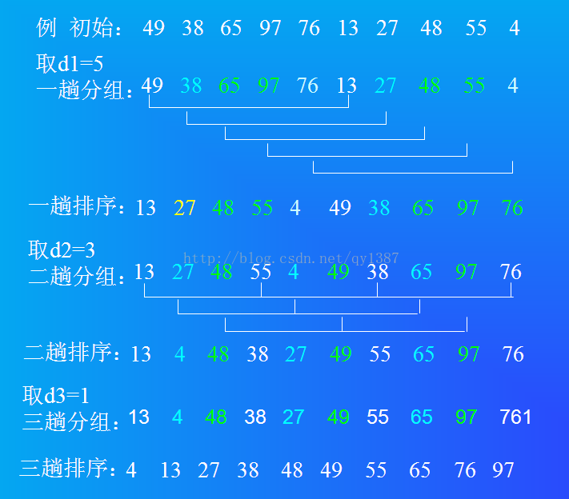
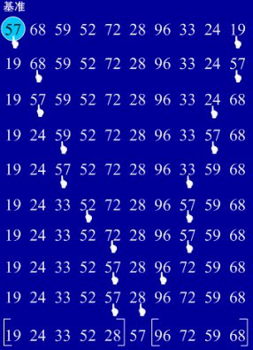
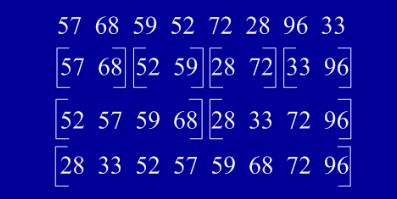

### 常用的排序

java中常用的几种排序：选择排序、插入排序、快速排序、冒泡排序、归并排序、shell排序。 


**选择排序**
思路：在乱序数组中，假设第一位数最小，依次让后面的数与之比较，若遇到比它小的数就交换位置，
一趟下来第一个数就是序列中最小的数，然后从第二个数开始重复操作。
```java
    public static void selectSort(int[] array) {  
        int position = 0;  
        for (int i = 0; i < array.length; i++) {  
            int j = i + 1;  
            position = i;  
            int temp = array[i];  
            for (; j < array.length; j++) {  
                if (array[j] < temp) {  
                    temp = array[j];  
                    position = j;  
                }  
            }  
            array[position] = array[i];  
            array[i] = temp;  
        }  
        System.out.println(Arrays.toString(array) + " selectSort");  
    }
```
      

**插入排序**
思路：如同玩扑克牌一样，每次摸牌都将它与手中的牌比较，始终将牌放在比它大的牌前面，比它小的牌后面。
这样当牌全部摸到手上后，就是一个有序的序列。
```java
public static void insertSort(int[] array) {  
     for (int i = 1; i < array.length; i++) {  
         int temp = array[i];  
         int j = i - 1;  
         for (; j >= 0 && array[j] > temp; j--) {  
             //将大于temp的值整体后移一个单位  
             array[j + 1] = array[j];  
         }  
         array[j + 1] = temp;  
     }  
     System.out.println(Arrays.toString(array) + " insertSort");  
 } 
``` 

**shell排序**
希尔排序，也称递减增量排序算法，是插入排序的一种更高效的改进版本。希尔排序是非稳定排序算法。 
希尔排序是基于插入排序的以下两点性质而提出改进方法的： 
插入排序在对几乎已经排好序的数据操作时，效率高，即可以达到线性排序的效率； 
但插入排序一般来说是低效的，因为插入排序每次只能将数据移动一位。 
先取一个正整数d1 < n, 把所有相隔d1的记录放一组，每个组内进行直接插入排序；
然后d2 < d1，重复上述分组和排序操作；直至di = 1，即所有记录放进一个组中排序为止。



```java
    public static void shellSort(int[] array) {  
        int i;  
        int j;  
        int temp;  
        int gap = 1;  
        int len = array.length;  
        while (gap < len / 3) { gap = gap * 3 + 1; }  
        for (; gap > 0; gap /= 3) {  
            for (i = gap; i < len; i++) {  
                temp = array[i];  
                for (j = i - gap; j >= 0 && array[j] > temp; j -= gap) {  
                    array[j + gap] = array[j];  
                }  
                array[j + gap] = temp;  
            }  
        }  
        System.out.println(Arrays.toString(array) + " shellSort");  
    }
```     
      
**冒泡排序**
思路：在要排序的一组数中，对当前还未排好序的范围内的全部数，自上而下对相邻的两个数依次进行比较和调整，
让较大的数往下沉，较小的往上冒。即：每当两相邻的数比较后发现它们的排序与排序要求相反时，就将它们互换。 

```java
    public static void bubbleSort(int[] array) {  
        int temp = 0;  
        for (int i = 0; i < array.length - 1; i++) {  
            for (int j = 0; j < array.length - 1 - i; j++) {  
                if (array[j] > array[j + 1]) {  
                    temp = array[j];  
                    array[j] = array[j + 1];  
                    array[j + 1] = temp;  
                }  
            }  
        }  
        System.out.println(Arrays.toString(array) + " bubbleSort");  
    }  
```
    
**快速排序**
快速排序是排序方法里面速率最快的一种方法，是对冒泡排序的一种改进， 属于不稳地排序。 



```java
public static void quickSort(int[] array) {  
    _quickSort(array, 0, array.length - 1);  
    System.out.println(Arrays.toString(array) + " quickSort");  
}  

private static int getMiddle(int[] list, int low, int high) {  
    int tmp = list[low];    //数组的第一个作为中轴  
    while (low < high) {  
        while (low < high && list[high] >= tmp) {  
            high--;  
        }  

        list[low] = list[high];   //比中轴小的记录移到低端  
        while (low < high && list[low] <= tmp) {  
            low++;  
        }  

        list[high] = list[low];   //比中轴大的记录移到高端  
    }  
    list[low] = tmp;              //中轴记录到尾  
    return low;                  //返回中轴的位置  
}  

private static void _quickSort(int[] list, int low, int high) {  
    if (low < high) {  
        int middle = getMiddle(list, low, high); //将list数组进行一分为二  
        _quickSort(list, low, middle - 1);       //对低字表进行递归排序  
        _quickSort(list, middle + 1, high);      //对高字表进行递归排序  
    }  
} 
```


**归并排序**
思路：归并（Merge）排序法是将两个（或两个以上）有序表合并成一个新的有序表，
即把待排序序列分为若干个子序列，每个子序列是有序的。然后再把有序子序列合并为整体有序序列。


 
```java
public static void mergingSort(int[] array) {  
        sort(array, 0, array.length - 1);  
        System.out.println(Arrays.toString(array) + " mergingSort");  
    }  

    private static void sort(int[] data, int left, int right) {  
        if (left < right) {  
            //找出中间索引  
            int center = (left + right) / 2;  
            //对左边数组进行递归  
            sort(data, left, center);  
            //对右边数组进行递归  
            sort(data, center + 1, right);  
            //合并  
            merge(data, left, center, right);  
        }  
    }  

    private static void merge(int[] data, int left, int center, int right) {  
        int[] tmpArr = new int[data.length];  
        int mid = center + 1;  
        //third记录中间数组的索引  
        int third = left;  
        int tmp = left;  
        while (left <= center && mid <= right) {  
            //从两个数组中取出最小的放入中间数组  
            if (data[left] <= data[mid]) {  
                tmpArr[third++] = data[left++];  
            } else {  
                tmpArr[third++] = data[mid++];  
            }  
        }  

        //剩余部分依次放入中间数组  
        while (mid <= right) {  
            tmpArr[third++] = data[mid++];  
        }  

        while (left <= center) {  
            tmpArr[third++] = data[left++];  
        }  

        //将中间数组中的内容复制回原数组  
        while (tmp <= right) {  
            data[tmp] = tmpArr[tmp++];  
        }  
    }
```
[参考链接](https://www.cnblogs.com/chengxiao/p/6194356.html)     


