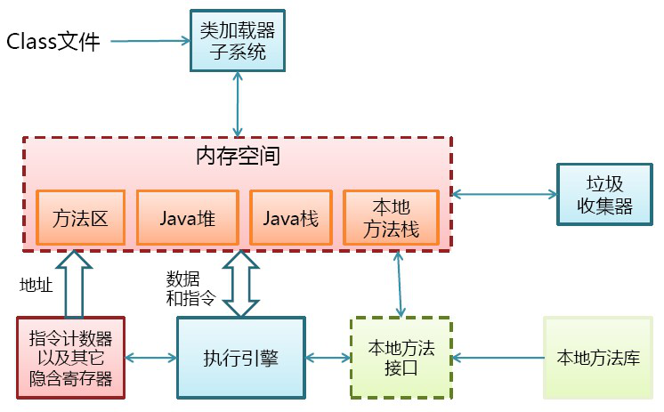
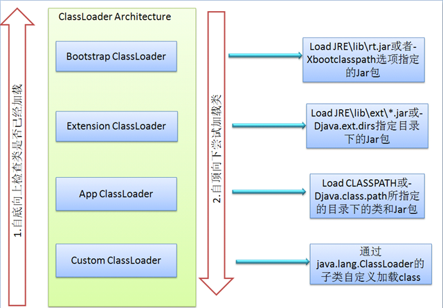
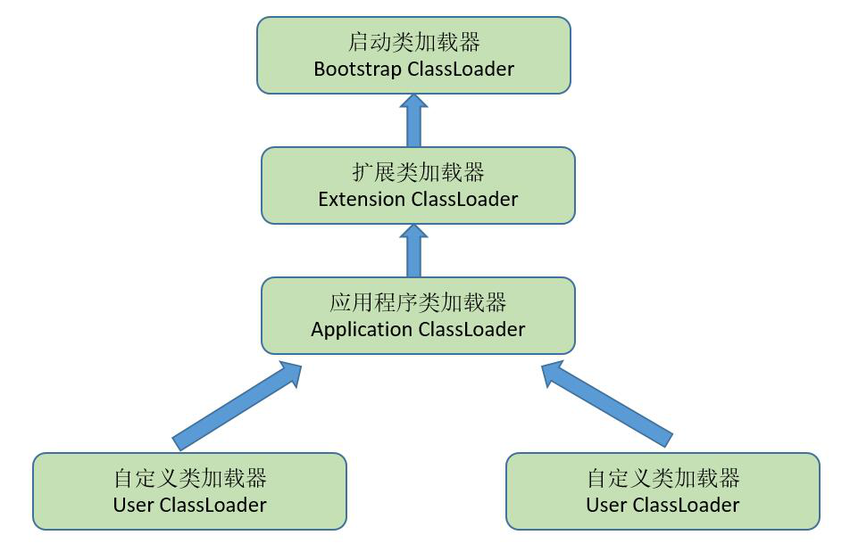

## java类的加载机制

- [1、类的加载过程](#类的加载过程)
- [2、类的初始化](#类的初始化)
- [3、类的加载](#类的加载)
- [4、类加载器](#类加载器)
- [5、双亲委派模型](#双亲委派模型)

### 类的加载过程 
JVM将类加载过程分为三个步骤：装载（Load）、链接（Link）和初始化(Initialize)，链接又分为三个步骤，如下图所示：

1) 装载：查找和导入Class文件；
2) 链接：把类的二进制数据合并到JRE中；
    - 校验：检查载入Class文件数据的正确性；
    - 准备：给类的静态变量分配存储空间；
    - 解析：将符号引用转成直接引用；
3) 初始化：对类的静态变量，静态代码块执行初始化操作

### 类的初始化 
 创建类的实例，也就是new一个对象
 访问某个类或接口的静态变量，或者对该静态变量赋值
 调用类的静态方法
 反射（Class.forName("com.lyj.load")）
 初始化一个类的子类（会首先初始化子类的父类）
 JVM启动时标明的启动类，即文件名和类名相同的那个类

只有这6种情况才会导致类的类的初始化。

类的初始化步骤：
1. 如果这个类还没有被加载和链接，那先进行加载和链接
2. 假如这个类存在直接父类，并且这个类还没有被初始化，那就初始化直接的父类；
3. 假如类中存在初始化语句，那就依次执行这些初始化语句。

### 类的加载 
类的加载指的是将类的.class文件中的二进制数据读入到内存中，将其放在运行时数据区的方法区内，然后在堆区创建一个这个类的Java.lang.Class对象，用来封装类在方法区类的对象。看下图：

类的加载的最终产品是位于堆区中的Class对象，它封装了类在方法区内的数据结构，并且向Java程序员提供了访问方法区内的数据结构的接口

加载类的方式有以下几种：
 从本地系统直接加载
 通过网络下载.class文件
 从zip，jar等归档文件中加载.class文件
 从专有数据库中提取.class文件
 将Java源文件动态编译为.class文件（服务器）

### 类加载器 
JVM的类加载是通过ClassLoader及其子类来完成的，类的层次关系和加载顺序可以由下图来描述：

1. Bootstrap ClassLoader —— 启动类加载器
   
   负责加载$JAVA_HOME中jre/lib/rt.jar里所有的class
   
2. Extension ClassLoader —— 扩展类加载器

   负责加载java平台中扩展功能的一些jar包，包括$JAVA_HOME中jre/lib/*.jar或-Djava.ext.dirs指定目录下的jar包

3. App ClassLoader —— 应用程序类加载器

   负责记载classpath中指定的jar包及目录中class

4. Custom ClassLoader

   属于应用程序根据自身需要自定义的ClassLoader
   
加载过程中会先检查类是否被已加载，检查顺序是**自底向上**，从Custom ClassLoader到BootStrap ClassLoader逐层检查，
只要某个classloader已加载就视为已加载此类，保证此类只被ClassLoader加载一次。而加载顺序是**自顶向下**，先由上层来逐层加载此类。

### 双亲委派模型 

某个特定的类加载器在接到加载类的请求时，首先将加载任务委托给父类加载器，依次递归，如果父类加载器可以完成类加载任务，就成功返回；
只有父类加载器无法完成此加载任务时，才自己去加载