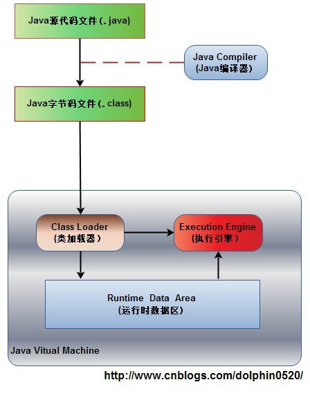
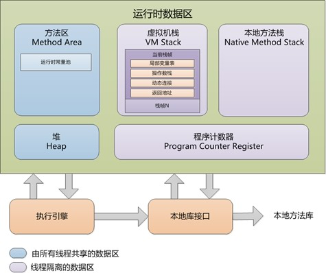

## JVM内存区域划分

- [1. Java程序具体执行的过程](#Java程序具体执行的过程)
- [2. 运行时数据区包括哪几部分](#运行时数据区包括哪几部分)
- [3. 线程独占与线程共享](#线程独占与线程共享)

### Java程序具体执行的过程
我们先来看下程序的执行过程：

如上图所示 :
1. Java源代码文件(.java后缀)会被Java编译器编译为字节码文件(.class后缀)，
2. 由JVM中的类加载器加载各个类的字节码文件，
3. 加载完毕之后，交由JVM执行引擎执行。
4. 在整个程序执行过程中，JVM会用一段空间来存储程序执行期间需要用到的数据和相关信息，这段空间一般被称作为Runtime Data Area（运行时数据区），也就是JVM内存。	
   因此，常说到的Java内存管理就是针对这段空间进行管理（如何分配和回收内存空间）。

### 运行时数据区包括哪几部分

根据《Java虚拟机规范》的规定，运行时数据区通常包括这几个部分，**其中方法区和堆是所有工作线程共享的，而栈、程序计数器和本地方法栈是线程私有的。**

**1. 程序计数器**
- 作用：指向当前线程下一条需要执行的字节码指令的地址
- 内存溢出：不会发生
   
  
**2. 虚拟机栈**
- 作用：由栈帧组成、每个栈帧代表一次方法调用，其包含存储变量表、操作数栈和方法出口三个部分，方法执行完成后该栈帧将被弹出。
- 内存溢出：StackOverflowError和OutOfMemoryError。
- 溢出原因：
    - StackOverflowError：如果请求的栈的深度大于虚拟机所允许的深度，将会抛出这个异常，如果使用虚拟机默认参数，一般达到1000到2000这样的深度没有问题。
    - OutOfMemoryError：因为除掉堆内存和方法区容量，剩下的内存由虚拟机栈和本地方法栈瓜分，如果剩下的内存不足以满足更多的工作线程的运行、或者不足以拓展虚拟机栈的时候，就会抛出OutOfMemoryError异常。

- 解决方法：
    - 针对StackOverflowError：
        1. 首先栈溢出会输出异常信息，根据信息查看对应的方法调用是否出现无限调用、或者栈帧过大等代码逻辑上的问题，通过修改代码逻辑解决；
        
        2. 如果确确实实需要更大的栈容量，可以检查并调大栈容量：-Xss16m。
    - 针对OutOfMemoryError：
        1. 首先检查是否创建过多的线程，减少线程数。
        
        2. 可以通过“减少最大堆容量”或“减少栈容量”来解决。

**3. 本地方法栈**
- 作用：与虚拟机栈唯一的不同是虚拟机栈执行的是java方法，而本地方法栈执行的是本地的C/C++方法
- 内存溢出：StackOverflowError和OutOfMemoryError
    - 溢出原因：同虚拟机栈
    - 解决方法：同虚拟机栈

**4. 堆**
- 作用：所有线程共享，存放对象实例
- 内存溢出：OutOfMemoryError:Java heap space
- 溢出原因：堆中没有足够内存完成实例分配，并且无法继续拓展时
- 解决方法：
    1. 内存泄露检查：首先通过“内存溢出快照 + MAT等分析工具”，分析是否存在内存泄露现象，检查时可以怀疑的点比如集合、第三方库如数据库连接的使用、new关键字相关等。
    2. 如果没有内存泄露，那么就是内存溢出，所有对象却是都还需要存活，这个时候就只能调大堆内存了：-Xms和-Xmx。

**5. 方法区**
- 作用：所有线程共享，存放已加载的class信息、常量、静态变量和即时编译后的代码
- 内存溢出：OutOfMemoryError:PermGen space
- 溢出原因：方法区没有足够内存完成内存分配存放运行时新加载的class信息
- 解决方法：
    1. 内存泄露检查：检查是否加载过多class文件(jar文件)，或者重复加载相同的class文件(jar文件)多次
    2. 通过-XX:PermSize=64M -XX:MaxPermSize=128M改大方法区大小

**6. 运行时常量池**
- 作用：方法区的一部分，存放常量
- 内存溢出：OutOfMemoryError:PermGen space
- 溢出原因：方法区没有足够的内存完成内存分配，存放运行时新创建的常量，比如String类的intern()方法，其作用是如果常量池已经包含一个相同的字符串，则返回其引用，否则将此String对象包含的字符串添加到常量池中。
- 解决方法：
    1. 内存泄露检查：检查是否创建过多常量
    2. 通过-XX:PermSize=64M -XX:MaxPermSize=128M改大方法区大小

**7. 直接内存**
- 作用：不属于JVM运行时数据区，也不是虚拟机规范中定义的内存区域，JDK1.4引入的NIO中包含通道Channel和缓冲区Buffer，应用程序从通道获取数据是先经过OS的内核缓冲区，再拷贝至Buffer，因为比较耗时，所以Buffer提供了一种直接操作操作系统缓冲区的方式，即ByteBuffer.allocateDirector(size)，这个方法返回DirectByteBuffer应用就是指向这个底层存储空间关联的缓冲区，即直接内存(native memory)，或者叫堆外内存。
- 内存溢出：OutOfMemoryError
- 溢出原因：JVM所需内存 + 直接内存 > 机器物理内存(或操作系统级限制)，无法动态拓展
- 判断方法：内存泄露检查：例如内存占用较高，机器性能骤降，但是通过GC信息或者jstat发现GC很少，通过jmap获得快照分析后也没发现什么异常，而程序中又直接或者间接地用到了NIO，那么和可能就是直接内存泄露了。
- 解决方法：分析NIO相关的程序逻辑解决。

### 线程独占与线程共享
**线程共享的内容包括：** 
 进程 代码段
 进程的公有数据(利用这些共享的数据，线程很容易的实现相互之间的通讯)
 进程打开的文件描述符
 信号的处理器
 进程的当前目录
 进程用户 ID 与进程组 ID

**线程独有的内容包括：** 
 线程 ID
 寄存器组的值
 线程的栈
 错误返回码
 线程的信号屏蔽码

