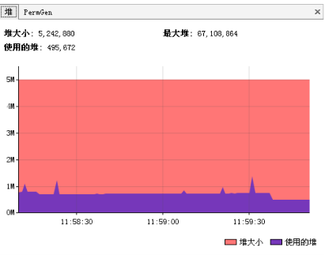
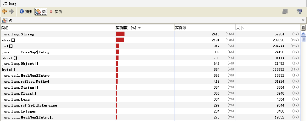
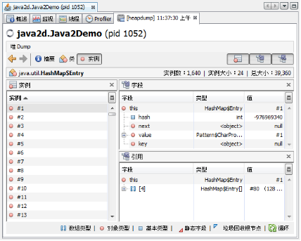
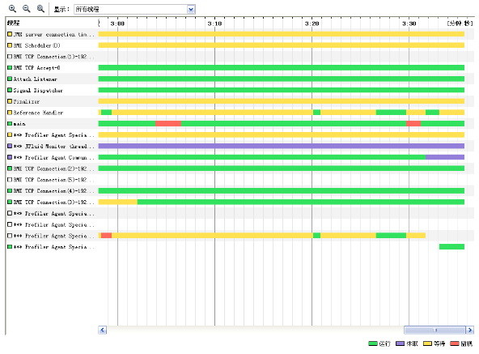
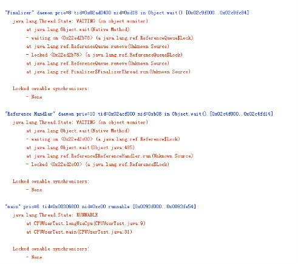
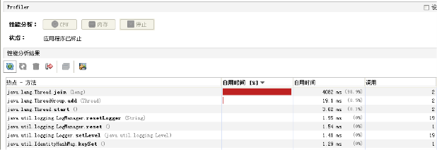
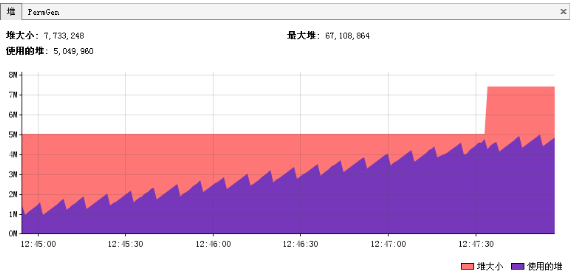

## JVM VM内存参数设置及调优

**JVM调优工具：Jconsole，jProfile，VisualVM**

- **Jconsole** —— jdk自带，功能简单，但是可以在系统有一定负荷的情况下使用。对垃圾回收算法有很详细的跟踪。
- **JProfiler** —— 商业软件，需要付费。功能强大。
- **VisualVM** —— JDK自带，功能强大，与JProfiler类似。推荐。

**如何调优**
- 观察内存释放情况、集合类检查、对象树；
- 上面这些调优工具都提供了强大的功能，但是总的来说一般分为以下几类功能：

**堆信息查看**

可查看堆空间大小分配（年轻代、年老代、持久代分配）

**垃圾监控（长时间监控回收情况）**

查看堆内类、对象信息查看：数量、类型等

对象引用情况查看

有了堆信息查看方面的功能，我们一般可以顺利解决以下问题：
1. 年老代年轻代大小划分是否合理
2. 内存泄漏
3. 垃圾回收算法设置是否合理

**线程监控**

线程信息监控：系统线程数量。

线程状态监控：各个线程都处在什么样的状态下

Dump线程详细信息：查看线程内部运行情况
死锁检查 
热点分析

- CPU热点：检查系统哪些方法占用的大量CPU时间
- 内存热点：检查哪些对象在系统中数量最大（一定时间内存活对象和销毁对象一起统计）

这两个东西对于系统优化很有帮助。我们可以根据找到的热点，有针对性的进行系统的瓶颈查找和进行系统优化，而不是漫无目的的进行所有代码的优化。

**内存泄漏检查**
内存泄漏是比较常见的问题，而且解决方法也比较通用，这里可以重点说一下，而线程、热点方面的问题则是具体问题具体分析了。

内存泄漏一般可以理解为系统资源（各方面的资源，堆、栈、线程等）在错误使用的情况下，导致使用完毕的资源无法回收（或没有回收），从而导致新的资源分配请求无法完成，引起系统错误。

内存泄漏对系统危害比较大，因为他可以直接导致系统的崩溃。

需要区别一下，内存泄漏和系统超负荷两者是有区别的，虽然可能导致的最终结果是一样的。内存泄漏是用完的资源没有回收引起错误，而系统超负荷则是系统确实没有那么多资源可以分配了（其他的资源都在使用）。

**年老代堆空间被占满**
- 异常： java.lang.OutOfMemoryError: Java heap space
- 说明：
    
    这是最典型的内存泄漏方式，简单说就是所有堆空间都被无法回收的垃圾对象占满，虚拟机无法再在分配新空间。
- 解决：这种方式解决起来也比较容易，一般就是根据垃圾回收前后情况对比，同时根据对象引用情况（常见的集合对象引用）分析，基本都可以找到泄漏点。

**持久代被占满**
- 异常：java.lang.OutOfMemoryError: PermGen space
- 说明：Perm空间被占满。无法为新的class分配存储空间而引发的异常。这个异常以前是没有的，但是在Java反射大量使用的今天这个异常比较常见了。主要原因就是大量动态反射生成的类不断被加载，最终导致Perm区被占满。
- 解决：1. -XX:MaxPermSize=16m；  2. 换用JDK。比如JRocket。

**堆栈溢出**
- 异常：java.lang.StackOverflowError
- 说明：这个就不多说了，一般就是递归没返回，或者循环调用造成

**线程堆栈满**
- 异常：Fatal: Stack size too small
- 说明：java中一个线程的空间大小是有限制的。JDK5.0以后这个值是1M。与这个线程相关的数据将会保存在其中。但是当线程空间满了以后，将会出现上面异常。
- 解决：增加线程栈大小。-Xss2m。但这个配置无法解决根本问题，还要看代码部分是否有造成泄漏的部分。

**系统内存被占满**
- 异常：java.lang.OutOfMemoryError: unable to create new native thread
- 说明：这个异常是由于操作系统没有足够的资源来产生这个线程造成的。系统创建线程时，除了要在Java堆中分配内存外，操作系统本身也需要分配资源来创建线程。因此，当线程数量大到一定程度以后，堆中或许还有空间，但是操作系统分配不出资源来了，就出现这个异常了。
    分配给Java虚拟机的内存愈多，系统剩余的资源就越少，因此，当系统内存固定时，分配给Java虚拟机的内存越多，那么，系统总共能够产生的线程也就越少，两者成反比的关系。同时，可以通过修改-Xss来减少分配给单个线程的空间，也可以增加系统总共内生产的线程数。
- 解决：
    1. 重新设计系统减少线程数量。
    2. 线程数量不能减少的情况下，通过-Xss减小单个线程大小，以便生产更多的线程。