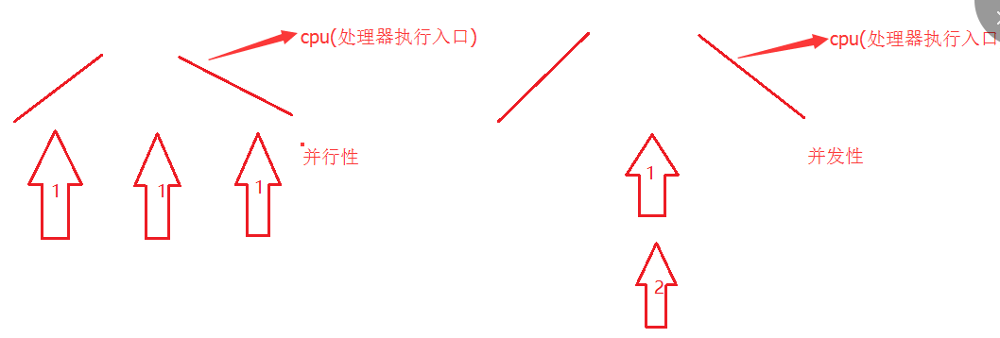

## 线程，进程，协程

- [一. 初识线程](#初识线程)
    - [1.1 进程与线程](#进程与线程)
    - [1.2 线程的创建和启动](#线程的创建和启动)
    - [1.3 创建线程的三种方式对比](#创建线程的三种方式对比)
    - [1.4 线程的生命周期](#线程的生命周期)
- [二、线程的创建及使用](#线程的创建及使用)
    - [2.1 join线程](#join线程)
    - [2.2 后台线程](#后台线程)
    - [2.3 线程睡眠：sleep](#线程睡眠)
    - [2.4 线程让步](#线程让步)
    - [2.5 改变线程优先级](#改变线程优先级)
- [三、线程同步和线程安全问题](#线程同步和线程安全问题)
    - [3.1 线程安全](#线程安全)
    - [3.2 同步代码块](#同步代码块)
    - [3.3 同步方法](#同步方法)
    - [3.4 同步锁](#同步锁)
    - [3.5 死锁](#死锁)

### 初识线程
#### 进程与线程
几乎任何的操作系统都支持运行多个任务，通常一个任务就是一个程序，而一个程序就是一个进程。
当一个进程运行时，内部可能包括多个顺序执行流，每个顺序执行流就是一个线程。

**进程：** 进程是指处于运行过程中的程序，并且具有一定的独立功能。进程是系统进行资源分配和调度的一个单位。当程序进入内存运行时，即为进程。
 
进程的三个特点：
1. **独立性：** 进程是系统中独立存在的实体，它可以独立拥有资源，每一个进程都有自己独立的地址空间，没有进程本身的运行，用户进程不可以直接访问其他进程的地址空间。
2. **动态性：** 进程和程序的区别在于进程是动态的，进程中有时间的概念，进程具有自己的生命周期和各种不同的状态。
3. **并发性：** 多个进程可以在单个处理器上并发执行，互不影响。

并发性和并行性是不同的概念：并行是指同一时刻，多个命令在多个处理器上同时执行；并发是指在同一时刻，只有一条命令是在处理器上执行的，但多个进程命令被快速轮换执行，使得在宏观上具有多个进程同时执行的效果
 


**线程：** 线程是进程的组成部分，一个进程可以拥有多个线程，而一个线程必须拥有一个父进程。线程可以拥有自己的堆栈，自己的程序计数器和自己的局部变量，但不能拥有系统资源。它与父进程的其他线程共享该进程的所有资源。

线程的特点：
- 线程可以完成一定任务，可以和其它线程共享父进程的共享变量和部分环境，相互协作来完成任务。
- 线程是独立运行的，其不知道进程中是否还有其他线程存在。
- 线程的执行是抢占式的，即当前执行的线程随时可能被挂起，以便运行另一个线程。
- 一个线程可以创建或撤销另一个线程，一个进程中的多个线程可以并发执行

#### 线程的创建及使用
**1.21 继承Thread类创建线程类**

步骤如下：
1. 定义Thread的子类，重写该类的run()方法
2. 创建Thread子类的实例，创建子线程对象
3. 调用线程对象的start()方法

```java
public class FirstThread  extends Thread{

    private int i;

    public void run(){
        for (; i < 100; i++) {
            System.out.println(getName()+" "+i);
        }

    }

    public static void main(String[] args) {
        for (int i = 0; i < 100; i++) {
            System.out.println(Thread.currentThread().getName());

            if(i == 20){
              new FirstThread().start();
              new FirstThread().start();
            }
        }
    }

}
```

**1.2.2 实现Runnable接口创建线程类**
1. 定义Runnable接口的实现类,并重写该类的run()方法
2. 创建Runnable接口实现类的实例，并以此实例作为Thread的target来创建Thread对象
3. 调用线程对象的start()方法

**1.2.3 使用Callable和Future创建线程**

Java 5开始，Java提供了Callable接口，该接口提供了一个call()方法可以作为线程执行体，但call()方法更加强大
- call()方法有返回值
- call()方法可以声明抛出异常。

Java 5提供了Future接口来代表Callable接口里call()方法的返回值，并未Future接口提供了FutureTask实现类，该类实现了，
Future接口和Runnable接口,可以作为Thread类的target。

在Future接口定义了如下公共方法来控制关联的Callable任务
- boolean cancle(boolean mayInterruptRunning)：试图取消Future里关联的Callable任务
- V get()：返回Callable任务里call()方法的返回值
- V get(Long timeout,TimeUnit unit)：返回Callable任务里call()方法的返回值。该方法让程序最多阻塞timeout和unit指定的时间，如果经过指定时间后Callable任务依然没有返回值，将会抛出TimeoutException。
- boolean isCancelled()：如果Callable任务正常完成前被取消，则返回true。
- boolean isdone()：如果Callable任务已完成，则返回true。

创建启动有返回值的线程步骤如下：

① 创建Callable接口的实现类，并实现Call()方法，该Call()方法将作为线程执行体，且该Call方法有返回值，在创建Callable实现类的实例

② 使用FutureTask类来包装Callable对象，该FutureTask对象封装了该Callable对象的call()方法

③ 使用FutureTask对象作为Thread对象的Target创建并启动线程

④ 调用FutureTask对象的get()方法来获得子线程执行结束后的返回值

```java
import java.util.concurrent.Callable;
import java.util.concurrent.FutureTask;

public class ThirdThread {

    public static void main(String[] args) {
        ThirdThread rt = new ThirdThread();
        FutureTask task = new FutureTask((Callable<Integer>)() ->{
            int i =0;

            for (; i <100 ; i++) {
                System.out.println(Thread.currentThread().getName()+"循环变量的值"+i);
            }
            return i;
        });
        for (int i = 0; i < 100; i++) {
            System.out.println(Thread.currentThread().getName()+"循环变量的值"+i);
            if(i == 20){
                new Thread(task,"有返回值的线程").start();
            }
        }
      try{
          System.out.println("子线程的返回值："+task.get());
      }catch(Exception ex){
            ex.printStackTrace();
      }
    }
}
```
#### 创建线程的三种方式对比
采用实现Runnable、Callable接口的方式创建多线程的优缺点
- 线程只是实现了Runnable接口或Callable接口，还可以继承其他类
- 在这种方式下，多个线程可以共享同一个target对象，所以非常适合多个相同线程来处理同一份资源的情况，从而可以将CPU，代码，数据分开，形成清晰的模型，较好体现面向对象的思想
- 劣势是，编程稍微复杂，如果需要访问当前线程，则必须使用Thread.currentThread()方法。

所以一般推荐使用实现Runnable、Callable接口的方式创建多线程。

#### 线程的生命周期
线程的生命周期经过：新建，就绪，运行，阻塞和死亡5种状态。
- 使用new关键字创建线程，该线程就处于新建状态。
- 当线程对象调用了start()方法之后，该程序就处于就绪状态，Java虚拟机回为其创建方法调用栈和程序计数器，处于这个状态的程序还没有开始运行，只是表示该线程可以运行了，至于何时开始运行，取决于JVM里线程调度器的调度。
- 处于就绪状态的线程获得了CPU，开始执行run()方法的线程执行体，则该线程处于运行状态。
- 当一个线程开始运行后，他不可能一直处于运行状态（除非它运行执行体非常短，一下子就执行完），线程在执行过程中需要被中断，目的使其他线程获得执行的机会，在选择下一个线程，系统会考虑线程的优先级。
- 当一个线程调用了它的sleep()和yield()方法后主动放弃所占用的资源。

**当发生如下情况，线程会进入阻塞状态：**
* 线程调用sleep()方法主动放弃所占用的处理器资源
* 线程调用了一个阻塞式的IO方法，在该方法返回前，该线程被阻塞
* 线程试图获得一个同步监视器，但该同步监视器正被其他线程所持有。
* 线程在等待某个通知
* 程序调用了线程的suspend()方法将该线程挂起。但这个方法容易导致死锁，应该尽量避免使用该方法。
* 被阻塞线程在合适的时候重新进入就绪状态。重新等待线程调度器调度它。

**当发生特定的情况时可以解除上面的阻塞**
* 调用sleep()方法的线程经过了指定时间
* 线程调用的阻塞式IO方法已经返回
* 线程成功的获得了试图取得同步监视器
* 线程正在等待某个通知时，其他线程发出了一个通知
* 处于挂起状态的线程被调用了resume()回复方法

**线程会以如下三种方式结束，进入死亡状态**
* run()或call()方法执行完成，线程正常结束
* 线程抛出一个为捕获的Exception
* 直接调用该线程的stop()方法来结束该线程——这个方法容易导致死锁，应该尽量避免使用该方法。

### 控制线程

#### join线程
Thread提供了让一个线程等待另一个线程完成的方法——join()方法。

当程序执行流中调用了其他线程的join()方法时，调用线程被阻塞，直到被join()方法加入的join线程执行完为止

join()方法通常由使用的线程的程序调用，将大问题划分许多小问题，每个小问题分配一个线程。当所有的小问题处理后，在调用主线程进一步处理。

```java
public class JoinThread extends Thread{
    public JoinThread(String name) {
        super(name);
    }

    @Override
    public void run() {
        for (int i = 0; i <100 ; i++) {
            System.out.println(getName()+" "+i);
        }
    }

    public static void main(String[] args) throws Exception {
        new JoinThread("新线程").start();
        for (int i = 0; i <100 ; i++) {
            if(i == 20){
                JoinThread jt = new JoinThread("被join的线程");
                jt.start();
                jt.join();
            }
            System.out.println(Thread.currentThread().getName()+" "+i);
        }
    }
}
```

#### 后台线程
有一种线程，后台执行的，它的任务是为其他线程提供服务。这种线程被称为后台线程，又称守护线程或精灵线程。JVM的垃圾回收线程就是典型的后台线程

后台线程有个特征：如果所有的前台线程都死亡，后台线程会自动死亡。调用Thread对象的setDaemon(true)方法可将指定线程设置成后台线程。

#### 线程睡眠：sleep
如果需要让正在执行的线程暂停一段时间，并进入阻塞状态，则可以通过Thread类的静态方法sleep()来实现。

在调用了sleep()方法之后，线程进入阻塞状态，在其睡眠时间内，该线程将不会获得执行的机会，即使系统中没有其他可执行的线程。

#### 线程让步
yield()方法是一个和sleep()方法有也是点相似的方法，它Thread类的提供的一个静态方法，它可以让当前正在执行的线程暂停，但它不会阻塞该线程，只是将线程转入就绪状态。yield()方法只是让当前的线程暂停一下，让系统的线程调度器重新调度一次，完全可能的情况是：当线程调用了yield()方法暂停之后，线程调度器又将其调度出来重新执行

**关于sleep()方法和yield()方法的区别**
* sleep()方法暂停当前线程后，会给其他线程执行机会，不会理会其他线程的优先级；但yield()方法只会给优先级相同，或优先级更高的线程执行机会
* sleep()方法会将线程转入阻塞状态，直到经过阻塞时间才会转入就绪状态；yield()方法只是强制将线程转入就绪状态
* sleep()方法声明抛出了InterruptedException异常，所以调用sleep()方法要么捕捉异常，要么显式声明抛出异常；而yield()方法则没有声明抛出异常。
* sleep()方法比yield()方法有更好的可移植性，通常不建议使用yield()方法来控制并发线程的执行

#### 改变线程优先级
每个线程执行时都具有一定的优先级，优先级高的线程得到更多执行的机会，而优先级低的线程则得到较少的执行机会。

每个线程默认的优先级都和创建它的父线程的优先级相同，默认情况下，main线程具有普通优先级，由main线程创建的子线程也具有普通优先级。

Thread类提供了setPriority(int new Priority)、getPriority()方法来设置和返回指定线程的优先级，其中setPriority(int new Priority)参数可以是一个整数，范围1~10，也可以使用Thread类的如下三个常量：
* MAX_PRIORITY:其值是10
* MIN_PRIORITY:其值是1
* NORM_PRIORITY:其值是5

### 线程同步和线程安全问题

#### 线程安全
脏数据问题，例如多个线程同时操作公共数据引发的数据出错问题，这里不再叙述

#### 同步代码块
为了解决上面的问题，Java多线程支持引入了同步监视器来解决这个问题，使用同步监视器的通用方法就是同步代码块。同步代码块的语法格式如下：
```java
synchronized(obj){
//此处代码就是同步代码块
}
```
上面代码的含义是：线程开始执行同步代码块之前，必须先获得同步监视器的锁定。

#### 同步方法

与同步代码块对应，Java的多线程安全还支持同步方法，同步方法就是用synchronized关键字来修饰某个方法，则该方法称为同步方法。
对于synchronized修饰的方法（非static方法）而言，无须显式指定同步监视器，同步方法的监视器是this,也就是调用该方法的对象

当执行了同步监视器的wait()方法，则当前线程暂停，并释放同步监视器。

#### 同步锁
从Java 5开始，Java提供了更强大的线程同步机制——通过显式定义同步锁对象实现同步，在这种机制下，同步锁由lock充当。

某些锁可能允许对贡献资源的访问。如ReadWriteLock,Lock,ReentrantRock(可重入锁）。为ReadWriteRock提供了ReentrantReadWriteLock实现类。

通常建议在Finally块确保在必要时释放锁。

#### 死锁
当两个线程相互等待对方释放锁是就会发生死锁。一旦出现死锁，整个程序将不会发生任何异常，也不会给出任何提示。只是所有的线程都处于阻塞状态，无法继续。

  