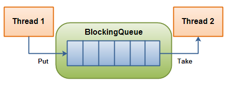

## 线程池

- [一、前言](#前言 )
- [二、初始化4种类型的线程池](#初始化4种类型的线程池 )
- [三、ThreadPoolExecutor内部具体实现](#ThreadPoolExecutor内部具体实现  )
- [四、线程池的状态](#线程池的状态)
- [五、线程池提交任务两种方式](#线程池提交任务两种方式)
- [六、线程池的关闭](#线程池的关闭)
- [七、ThreadPoolExecutor线程池参数设置技巧](#ThreadPoolExecutor线程池参数设置技巧)
- [八、如何实现一个自己的线程池](#如何实现一个自己的线程池)
- [九、如何实现一个阻塞队列](#如何实现一个阻塞队列)

### 前言
jdk1.5后引入Executors线程池框架，通过它把任务的提交和执行进行解耦，只需要定义好任务，然后提交给线程池，
而不用关心该任务是如何执行、被哪个线程执行，以及什么时候执行。

### 初始化4种类型的线程池                                                     

**newFixedThreadPool()**
- 说明：初始化一个指定线程数的线程池，其中corePoolSize == maxiPoolSize，使用LinkedBlockingQuene作为阻塞队列
- 特点：即使当线程池没有可执行任务时，也不会释放线程。

**newCachedThreadPool()**
- 说明：初始化一个可以缓存线程的线程池，默认缓存60s，线程池的线程数可达到Integer.MAX_VALUE，即2147483647，内部使用SynchronousQueue作为阻塞队列；
- 特点：在没有任务执行时，当线程的空闲时间超过keepAliveTime，会自动释放线程资源；当提交新任务时，如果没有空闲线程，则创建新线程执行任务，会导致一定的系统开销；
  因此，使用时要注意控制并发的任务数，防止因创建大量的线程导致而降低性能。

**newSingleThreadExecutor()**
- 说明：初始化只有一个线程的线程池，内部使用LinkedBlockingQueue作为阻塞队列。
- 特点：如果该线程异常结束，会重新创建一个新的线程继续执行任务，唯一的线程可以保证所提交任务的顺序执行

**newScheduledThreadPool()**
- 特定：初始化的线程池可以在指定的时间内周期性的执行所提交的任务，在实际的业务场景中可以使用该线程池定期的同步数据。

总结：除了newScheduledThreadPool的内部实现特殊一点之外，其它线程池内部都是基于ThreadPoolExecutor类（Executor的子类）实现的。


### ThreadPoolExecutor内部具体实现                                           

**ThreadPoolExecutor类构造器语法形式：**
ThreadPoolExecutor（corePoolSize,maxPoolSize,keepAliveTime,timeUnit,workQueue,threadFactory,handle);   

**方法参数：**
- corePoolSize：核心线程数
- maxPoolSize：最大线程数
- keepAliveTime：线程存活时间（在corePore<*<maxPoolSize情况下有用）
- timeUnit：存活时间的时间单位
- workQueue：阻塞队列（用来保存等待被执行的任务）
    
    注：关于workQueue参数的取值,JDK提供了4种阻塞队列类型供选择：
    1. ArrayBlockingQueue：基于数组结构的有界阻塞队列，按FIFO排序任务；
    2. LinkedBlockingQuene：基于链表结构的阻塞队列，按FIFO排序任务，吞吐量通常要高于ArrayBlockingQuene；
    3. SynchronousQuene：一个不存储元素的阻塞队列，每个插入操作必须等到另一个线程调用移除操作，否则插入操作一直处于阻塞状态，吞吐量通常要高于LinkedBlockingQuene；
    4. priorityBlockingQuene：具有优先级的无界阻塞队列；
- threadFactory：线程工厂，主要用来创建线程
- handler：表示当拒绝处理任务时的策略，有以下四种取值
    
    注： 当线程池的饱和策略，当阻塞队列满了，且没有空闲的工作线程，如果继续提交任务，必须采取一种策略处理该任务，线程池提供了4种策略：
    1. ThreadPoolExecutor.AbortPolicy:丢弃任务并抛出RejectedExecutionException异常。
    2. ThreadPoolExecutor.DiscardPolicy：也是丢弃任务，但是不抛出异常。
    3. ThreadPoolExecutor.DiscardOldestPolicy：丢弃队列最前面的任务，然后重新尝试执行任务（重复此过程）
    4. ThreadPoolExecutor.CallerRunsPolicy：由调用线程处理该任务
    当然也可以根据应用场景实现RejectedExecutionHandler接口，自定义饱和策略，如记录日志或持久化存储不能处理的任务。

### 线程池的状态（5种）                                                        
其中AtomicInteger变量ctl的功能非常强大：利用低29位表示线程池中线程数，通过高3位表示线程池的运行状态：
1. **RUNNING：** -1 << COUNT_BITS，即高3位为111，该状态的线程池会接收新任务，并处理阻塞队列中的任务；
2、**SHUTDOWN：** 0 << COUNT_BITS，即高3位为000，该状态的线程池不会接收新任务，但会处理阻塞队列中的任务；
3、**STOP ：** 1 << COUNT_BITS，即高3位为001，该状态的线程不会接收新任务，也不会处理阻塞队列中的任务，而且会中断正在运行的任务；
4、**TIDYING ：** 2 << COUNT_BITS，即高3位为010，该状态表示线程池对线程进行整理优化；
5、**TERMINATED：** 3 << COUNT_BITS，即高3位为011，该状态表示线程池停止工作；

### 线程池提交任务两种方式                                                      
有两种方式：
- Executor.execute(Runnable command);
- ExecutorService.submit(Callable<T> task);

**execute()内部实现**
1. 首次通过workCountof()获知当前线程池中的线程数，如果小于corePoolSize, 就通过addWorker()创建线程并执行该任务；否则，将该任务放入阻塞队列；
2. 如果能成功将任务放入阻塞队列中,  如果当前线程池是非RUNNING状态，则将该任务从阻塞队列中移除，然后执行reject()处理该任务；如果当前线程池处于RUNNING状态，则需要再次检查线程池（因为可能在上次检查后，有线程资源被释放），是否有空闲的线程；如果有则执行该任务；
3. 如果不能将任务放入阻塞队列中,说明阻塞队列已满；那么将通过addWoker()尝试创建一个新的线程去执行这个任务；如果addWoker()执行失败，说明线程池中线程数达到maxPoolSize,则执行reject()处理任务；

**sumbit()内部实现**
会将提交的Callable任务会被封装成了一个FutureTask对象，FutureTask类实现了Runnable接口，这样就可以通过Executor.execute()提交FutureTask到线程池中等待被执行，最终执行的是FutureTask的run方法； 

比较：两个方法都可以向线程池提交任务，execute()方法的返回类型是void，它定义在Executor接口中, 而submit()方法可以返回持有计算结果的Future对象，它定义在ExecutorService接口中，它扩展了Executor接口，
其它线程池类像ThreadPoolExecutor和ScheduledThreadPoolExecutor都有这些方法。 


### 线程池的关闭                                                     

ThreadPoolExecutor提供了两个方法，用于线程池的关闭，分别是shutdown()和shutdownNow()，其中：
- shutdown()：不会立即终止线程池，而是要等所有任务缓存队列中的任务都执行完后才终止，但再也不会接受新的任务
- shutdownNow()：立即终止线程池，并尝试打断正在执行的任务，并且清空任务缓存队列，返回尚未执行的任务

### ThreadPoolExecutor线程池参数设置技巧                                    

#### 一、ThreadPoolExecutor的重要参数
1. corePoolSize：核心线程数
    - 核心线程会一直存活，及时没有任务需要执行；
    - 当线程数小于核心线程数时，即使有线程空闲，线程池也会优先创建新线程处理；
    - 设置allowCoreThreadTimeout=true（默认false）时，核心线程会超时关闭；
    
2. queueCapacity：任务队列容量（阻塞队列）
    - 当核心线程数达到最大时，新任务会放在队列中排队等待执行

3. maxPoolSize：最大线程数
    - 当线程数>=corePoolSize，且任务队列已满时。线程池会创建新线程来处理任务
    - 当线程数=maxPoolSize，且任务队列已满时，线程池会拒绝处理任务而抛出异常

4. keepAliveTime：线程空闲时间
    - 当线程空闲时间达到keepAliveTime时，线程会退出，直到线程数量=corePoolSize
    - 如果allowCoreThreadTimeout=true，则会直到线程数量=0

5. allowCoreThreadTimeout：允许核心线程超时

6. rejectedExecutionHandler：任务拒绝处理器

    **两种情况会拒绝处理任务：**
    1. 当线程数已经达到maxPoolSize，切队列已满，会拒绝新任务
    2. 当线程池被调用shutdown()后，会等待线程池里的任务执行完毕，再shutdown。如果在调用shutdown()和线程池真正shutdown之间提交任务，会拒绝新任务
    3. 线程池会调用rejectedExecutionHandler来处理这个任务。如果没有设置默认是AbortPolicy，会抛出异常
    4. ThreadPoolExecutor类有几个内部实现类来处理这类情况：
        1. AbortPolicy 丢弃任务，抛运行时异常
        2. CallerRunsPolicy 执行任务
        3. DiscardPolicy 忽视，什么都不会发生
        4. DiscardOldestPolicy 从队列中踢出最先进入队列（最后一个执行）的任务
    5. 实现RejectedExecutionHandler接口，可自定义处理器
 
#### 二、ThreadPoolExecutor执行顺序
线程池按以下行为执行任务
1. 当线程数小于核心线程数时，创建线程。
2. 当线程数大于等于核心线程数，且任务队列未满时，将任务放入任务队列。
3. 当线程数大于等于核心线程数，且任务队列已满
    1. 若线程数小于最大线程数，创建线程
    2. 若线程数等于最大线程数，抛出异常，拒绝任务
 
#### 三、如何设置参数
默认值
- corePoolSize=1
- queueCapacity=Integer.MAX_VALUE
- maxPoolSize=Integer.MAX_VALUE
- keepAliveTime=60s
- allowCoreThreadTimeout=false
- rejectedExecutionHandler=AbortPolicy()

#### 如何来设置
1. 需要根据几个值来决定
    - tasks ：每秒的任务数，假设为500~1000
    - taskcost：每个任务花费时间，假设为0.1s
    - responsetime：系统允许容忍的最大响应时间，假设为1s
2. 做几个计算
    1. corePoolSize = 每秒需要多少个线程处理？ 
        
            threadcount = tasks*taskcost =  (500~1000)*0.1 = 50~100 个线程。corePoolSize设置应该大于50; 根据8020原则，如果80%的每秒任务数小于800，那corePoolSize设置为80即可;
    
    2. queueCapacity = (coreSizePool/taskcost)*responsetime
        
            计算可得 queueCapacity = 80/0.1*1 = 80。意思是队列里的线程可以等待1s，超过了的需要新开线程来执行;
            切记不能设置为Integer.MAX_VALUE，这样队列会很大，线程数只会保持在corePoolSize大小，当任务陡增时，不能新开线程来执行，响应时间会随之陡增。
    
    3. maxPoolSize = (max(tasks)- queueCapacity)/(1/taskcost)
    
            计算可得 maxPoolSize = (1000-80)/10 = 92
            （最大任务数-队列容量）/每个线程每秒处理能力 = 最大线程数
            
    4. rejectedExecutionHandler
    
               根据具体情况来决定，任务不重要可丢弃，任务重要则要利用一些缓冲机制来处理
               
    5. keepAliveTime和allowCoreThreadTimeout采用默认通常能满足
    
            以上都是理想值，实际情况下要根据机器性能来决定。如果在未达到最大线程数的情况机器cpu load已经满了，则需要通过升级硬件（呵呵）和优化代码，降低taskcost来处理。 

总结：线程池中的核心线程数，当提交一个任务时，线程池创建一个新线程执行任务，直到当前线程数等于corePoolSize；如果当前线程数为corePoolSize，继续提交的任务被保存到阻塞队列中，等待被执行；如果阻塞队列满了，那就创建新的线程执行当前任务；直到线程池中的线程数达到maxPoolSize,这时再有任务来，只能执行reject()处理该任务；
注：如果执行了线程池的prestartAllCoreThreads()方法，线程池会提前创建并启动所有核心线程。

### 如何实现一个自己的线程池                                                   


### 如何实现一个阻塞队列                                                       

阻塞队列与普通队列的区别在于，当队列是空的时，从队列中获取元素的操作将会被阻塞，或者当队列是满时，往队列里添加元素的操作会被阻塞。试图从空的阻塞队列中获取元素的线程将会被阻塞，直到其他的线程往空的队列插入新的元素。
同样，试图往已满的阻塞队列中添加新元素的线程同样也会被阻塞，直到其他的线程使队列重新变得空闲起来，如从队列中移除一个或者多个元素，或者完全清空队列，下图展示了如何通过阻塞队列来合作：


```java
public class BlockingQueue {
  private List queue = new LinkedList();
  private int  limit = 10;

  public BlockingQueue(int limit){
    this.limit = limit;
  }

  public synchronized void enqueue(Object item) 
		throws InterruptedException  {
    while(this.queue.size() == this.limit) {
      wait();
    }
    if(this.queue.size() == 0) {
      notifyAll();
    }
    this.queue.add(item);
  }

  public synchronized Object dequeue()
  throws InterruptedException{
    while(this.queue.size() == 0){
      wait();
    }
    if(this.queue.size() == this.limit){
      notifyAll();
    }
    return this.queue.remove(0);
  }
}
```

