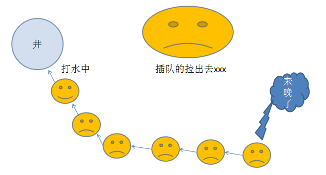
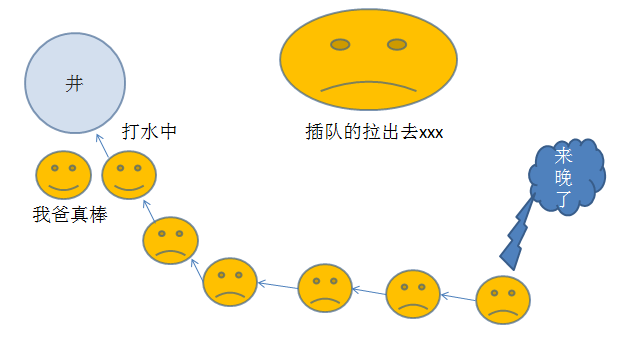
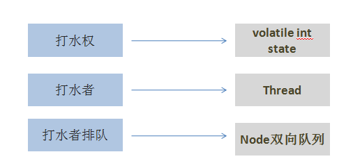
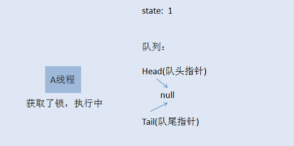
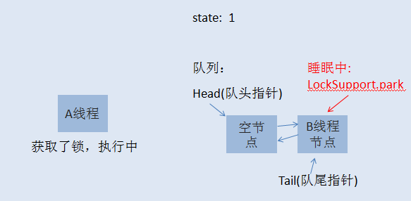
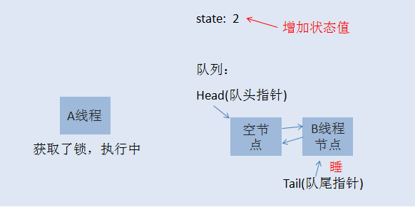
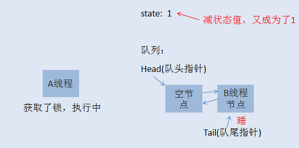

## ReentrantLock实现原理                                                      

### 听故事把知识掌握了
在一个村子里面，有一口井水，水质非常的好，村民们都想打井里的水。这井只有一口，村里的人那么多，所以得出个打水的规则才行。
村长绞尽脑汁，最终想出了一个比较合理的方案，咱们来仔细的看看聪明的村长大人的智慧。

井边安排一个看井人，维护打水的秩序。

打水时，以家庭为单位，哪个家庭任何人先到井边，就可以先打水，而且如果一个家庭占到了打水权，其家人这时候过来打水不用排队。
而那些没有抢占到打水权的人，一个一个挨着在井边排成一队，先到的排在前面。打水示意图如下 ：

是不是感觉很和谐，如果打水的人打完了，他会跟看井人报告，看井人会让第二个人接着打水。这样大家总都能够打到水。
是不是看起来挺公平的，先到的人先打水，当然不是绝对公平的，自己看看下面这个场景 :

看着，一个有娃的父亲正在打水，他的娃也到井边了，所以女凭父贵直接排到最前面打水，羡煞旁人了。 

以上这个故事模型就是所谓的公平锁模型，当一个人想到井边打水，而现在打水的人又不是自家人，这时候就得乖乖在队列后面排队。

事情总不是那么一帆风顺的，总会有些人想走捷径，话说看井人年纪大了，有时候，眼力不是很好，这时候，人们开始打起了新主意。新来打水的人，
他们看到有人排队打水的时候，他们不会那么乖巧的就排到最后面去排队，反之，他们会看看现在有没有人正在打水，
如果有人在打水，没辄了，只好排到队列最后面，但如果这时候前面打水的人刚刚打完水，正在交接中，排在队头的人还没有完成交接工作，
这时候，新来的人可以尝试抢打水权，如果抢到了，呵呵，其他人也只能睁一只眼闭一只眼，因为大家都默认这个规则了。
这就是所谓的非公平锁模型。新来的人不一定总得乖乖排队，这也就造成了原来队列中排队的人可能要等很久很久。 

### ReentrantLock实现细节
ReentrantLock支持两种获取锁的方式，
- 一种是公平模型，
- 一种是非公平模型。

在继续之前，咱们先把故事元素转换为程序元素。

### 公平锁模型

初始化时， state=0，表示无人抢占了打水权。这时候，村民A来打水(A线程请求锁)，占了打水权，把state+1，如下所示：

线程A取得了锁，把 state原子性+1,这时候state被改为1，A线程继续执行其他任务，然后来了村民B也想打水（线程B请求锁），
线程B无法获取锁，生成节点进行排队，如下图所示：

初始化的时候，会生成一个空的头节点，然后才是B线程节点，这时候，如果线程A又请求锁，是否需要排队？答案当然是否定的，
否则就直接死锁了。当A再次请求锁，就相当于是打水期间，同一家人也来打水了，是有特权的，这时候的状态如下图所示：

到了这里，相信大家应该明白了什么是可重入锁了吧。

**就是一个线程在获取了锁之后，再次去获取了同一个锁，这时候仅仅是把状态值进行累加。如果线程A释放了一次锁，就成这样了**：

仅仅是把状态值减了，只有线程A把此锁全部释放了，状态值减到0了，其他线程才有机会获取锁。
当A把锁完全释放后，state恢复为0，然后会通知队列唤醒B线程节点，使B可以再次竞争锁。
当然，如果B线程后面还有C线程，C线程继续休眠，除非B执行完了，通知了C线程。
注意，当一个线程节点被唤醒然后取得了锁，对应节点会从队列中删除。 

### 非公平锁模型
如果你已经明白了前面讲的公平锁模型，那么非公平锁模型也就非常容易理解了。当线程A执行完之后，要唤醒线程B是需要时间的，
而且线程B醒来后还要再次竞争锁，所以如果在切换过程当中，来了一个线程C，那么线程C是有可能获取到锁的，
如果C获取到了锁，B就只能继续乖乖休眠了。这里就不再画图说明了。 

### ReentrantLock可重入锁和synchronized的区别                           

1. **可重入性：** 
    
    从名字上理解，ReentrantLock的字面意思就是再进入的锁，其实synchronized关键字所使用的锁也是可重入的，
    两者关于这个的区别不大。两者都是同一个线程每进入一次，锁的计数器都自增1，所以要等到锁的计数器下降为0时才能释放锁。

2. **锁的实现：**
    
    Synchronized是依赖于JVM实现的，而ReentrantLock是JDK实现的，有什么区别，说白了就类似于操作系统来控制实现和用户自己敲代码实现的区别。
    前者的实现是比较难见到的，后者有直接的源码可供阅读。

3. **性能的区别：**

    在Synchronized优化以前，synchronized的性能是比ReentrantLock差很多的，但是自从Synchronized引入了偏向锁，
    轻量级锁（自旋锁）后，两者的性能就差不多了，在两种方法都可用的情况下，官方甚至建议使用synchronized，
    其实synchronized的优化我感觉就借鉴了ReentrantLock中的CAS技术。都是试图在用户态就把加锁问题解决，避免进入内核态的线程阻塞。

4. **功能区别：**
    
    便利性：很明显Synchronized的使用比较方便简洁，并且由编译器去保证锁的加锁和释放，而ReentrantLock需要手工声明来加锁和释放锁，为了避免忘记手工释放锁造成死锁，所以最好在finally中声明释放锁。
    锁的细粒度和灵活度：很明显ReentrantLock优于Synchronized

5. **ReentrantLock独有的能力：**
    
    - ReentrantLock可以指定是公平锁还是非公平锁。而synchronized只能是非公平锁。所谓的公平锁就是先等待的线程先获得锁。
    - ReentrantLock提供了一个Condition（条件）类，用来实现分组唤醒需要唤醒的线程们，而不是像synchronized要么随机唤醒一个线程要么唤醒全部线程。
    - ReentrantLock提供了一种能够中断等待锁的线程的机制，通过lock.lockInterruptibly()来实现这个机制。

6. **ReentrantLock实现的原理：**
    
    在网上看到相关的源码分析，本来这块应该是本文的核心，但是感觉比较复杂就不一一详解了，
    简单来说，ReentrantLock的实现是一种自旋锁，通过循环调用CAS操作来实现加锁。
    它的性能比较好也是因为避免了使线程进入内核态的阻塞状态。想尽办法避免线程进入内核的阻塞状态是我们去分析和理解锁设计的关键钥匙。