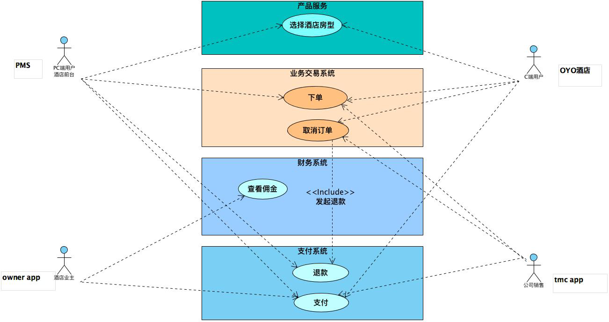
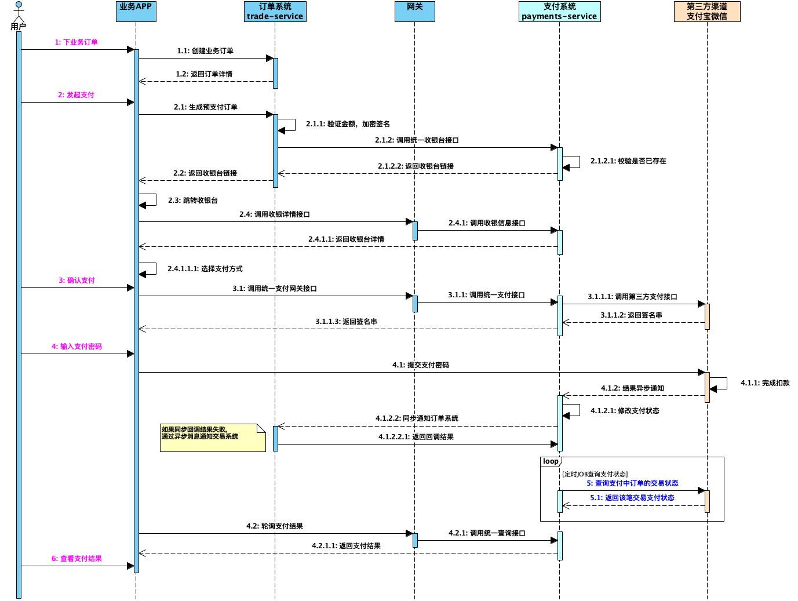
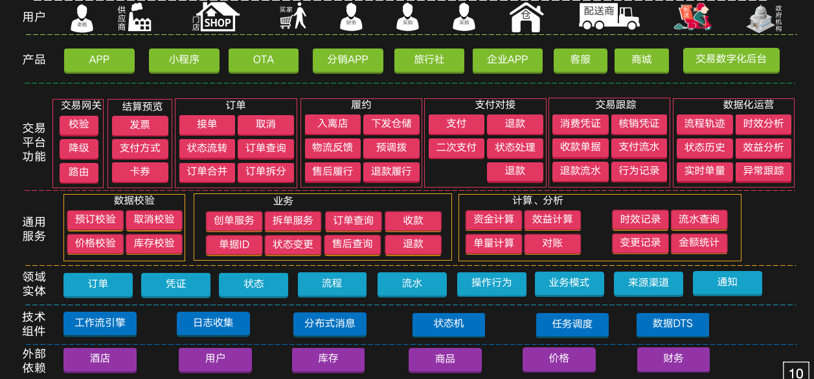
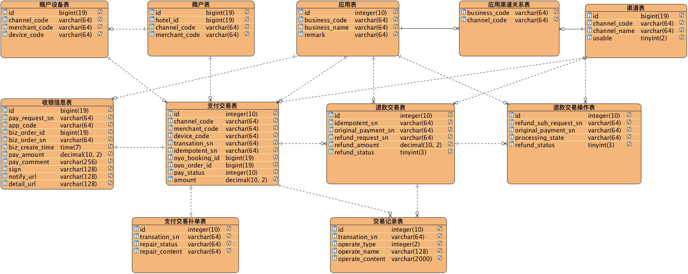

## 支付收银台设计

### 一、系统背景与目标
    支付收银台，顾名思义，跟支付系统有着密不可分的关系。
    当一个公司的业务比较单一，其实采用直连支付最为简洁方便，不管是从技术方案设计层面，还是从逻辑处理层面都比较简单；
    但是当一个公司支付的业务比较复杂的时候，有多种应用APP，小程序，Web端，PC端等支付业务需求时，此时就有必要考虑提供一个统一支付收银台；
    提供统一收银台，可以整合所有支付渠道，沉淀出灵活稳定的公共支付服务，而且便于统一维护和升级，快速响应业务端需求；

### 二、关键流程

### 三、用例图
**用例图如下**

**支付时序图**

**退款时序图**

### 四、逻辑架构
**整体应用逻辑架构**

**支付应用逻辑架构**

### 五、领域模型

### 六、DB模型
**数据模型**

**表结构分组**

**数据库脚本**

### 七、代码设计

### 八、其他设计
