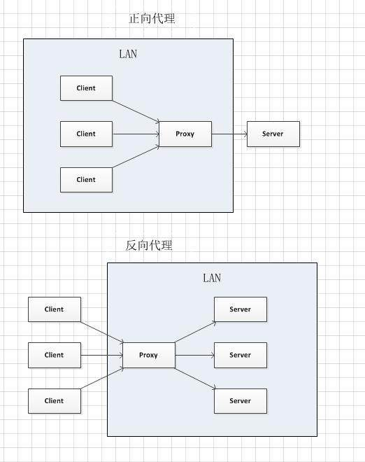

## 前端缓存

[一、Squid](#Squid)
[二、Varnish](#Varnish)

### Squid

#### 一、Squid是什么？
缓存服务器,即用来存储（内存及硬盘）用户访问的网页、图片、文件等等信息的专用服务器，
这种服务器不仅可以使用户最快的得到他们想要的信息，而且大大减少了网络传输的数据量，缓存服务器经常是代理服务器。对于用户是不可见。

目前常见的缓存服务器软件：squid、varnish、nginx

Squid是一个高性能的代理缓存服务器，Squid支持FTP、gopher和HTTP协议。和一般的代理缓存软件不同，Squid用一个单独的、非模块化的、I/O驱动的进程来处理所有的客户端请求。

Squid可运行在大多数Unix和OS/2版本的系统之上，已知的可工作的有： Windows, AIX，Digital Unix，FreeBSD，HP-UX，Irix，Linux，NetBSD，Nextstep，SCO，Solaris

代理服务器有以下几类：
1. 反向代理 
2. 正向代理（普通代理）
3. 透明代理 

#### 二、squid、varnish、nginx区别？
- varnish是觉得squid性能不行，纯内存缓存服务器方案
- nginx cache是属于不务正业，得益于nginx强大的性能

#### 三、Squid主要功能有哪些？
1. 缓存网站内容，以达到分担源站压力加快访问速度的目的。
2. 热点缓存，只缓存访问热度到达设定级别的网站内容。
3. 合并回源，多个相同的请求只回源一次。
4. ACL访问控制，可针对源IP、目的地IP、域名、URL、访问时间、单一最大连接数限制访问行为。或通过外部程序验证访问者（proxy_auth）。
5. 主要支持协议：HTTP、HTTPS、FTP
6. 网页内容篡改，可根据需求篡改网站内容。
7. 网站头部篡改，可根据需求篡改请求头部。
8. 可针对不同的域名或url配置不同的缓存规则。

#### 四、应用场景
**4.1 正向代理（本地网关）**
- 正向代理的典型用途是为在防火墙内的局域网客户端提供访问Internet的途径。
- 正向代理还可以使用缓存特性减少网络使用率。
- 正向代理允许客户端通过它访问任意网站并且隐藏客户端自身，因此你必须采取安全措施以确保仅为经过授权的客户端提供服务。

**4.2 透明代理（CDN，架设于网络运营商主干机房）**
- 提高各个地区访问者的访问速度。
- 减少源站压力。
- 减少网络运营商的网间结算费用。
- 节省网络运营商带宽资源。

**4.3 反向代理（网站前端）**
- 降低源站服务器的负载。
- 隐藏源站真实IP。

综上所述，如下图示：

#### 五、web缓存的相关概念

**a、cache命中**
cache命中是在cache server每次从它的缓存里满足客户端http请求发送。cache命中率，是所有客户端HTTP请求中的命中比例，
web缓存典型的cache命中率在30%到60%之间，另一个相似的度量单位叫做字节命中率，描述了cache提供服务的数据容量。

提高cache命中率的方法：
1. nginx/apache expries，cache-control缓存头
2. 动静分离，静态化，对静态走CDN
3. 设置数据库的cache等，如设置mysql 的cache，让缓存靠前
4. 4XX/5XX之类的错误页面，死链无法缓存。
5. 动态不走缓存
  
**b、cache丢失**
cache丢失在cache server不能从它的缓存里面满足客户端HTTP请求时发生，

cache丢失的原因有很多种：

        1、当cache server第一次接受到对第一个新资源的请求时，就会产生一个cache丢失，如何解决第一次命中？
        先预热或者预取
        a、内部先请求访问，可以通过脚本实现（可以通过python跑批）。
        b、后端生成数据之后，统一推到前端cache server，即预取、预热
        
        2、存储空间慢，或者对象自身过期，cache server会清除这些缓存对象，以释放空间给新对象
        如何解决问题2：
        a、增大内存或者磁盘。
        b、增大对象缓存时间
        c、参数设置，缓存参数设置打一下，最大缓存对象2M(想办法多缓存热门的数据)
        d、分资源缓存，如1M/10M/100M不同大小的分开缓存。（分拆服务器，acl正则匹配抛给不同的pools）

        3、还有可能是客户访问的资源不可到达，原始服务器指示cache server怎样处理用户响应，如：他会提示数据不能被缓存，或在有限的时间内才被重复使用等等。
        cache确认保证cache server不对访问的用户返回过期的数据，在重复使用缓存对象时，cache server需要经常从原始服务器确认它，假如服务器指示squid的拷贝仍旧有效，数据就发送出去，否则，squid更新它的存储拷贝，并且转发给客户
        当用户更新了数据到数据库或者存储服务器的时候，可以从业务角度主动调用接口清楚该对象缓存的指令。
对应缓存来讲，数据的一致性是一个特别头疼的问题，特别是memcached。
- CDN删除数据一般需要5-15分钟才能删除完成。
- 图片放到CDN一般是不要更新了，图片修改算更新，这种业务就要推送。
- 删除图片再上传，这种不算修改，而是一个新的资源。老是数据，CDN会有相应的算法，在一定的时间内自动删除。
- 网站改版：在CDN上推送js、css（改名推送）等程序。
 
#### 六、三种代理服务器的原理
**6.1普通代理（传统代理）**

传统的代理服务器就是通过浏览器设置代理的方法。

用户访问网站，先到squid代理服务器，如果squid代理服务器有数据，那么squid就直接从缓存中返回给用户，
如果squid缓存中没有，那么squid就代替用户去访问网站，把数据返回的给用户的同时留一份到缓存中，以便下次用户（或者其他用户）访问的时候，直接从缓存中返回给用户；

**6.2透明代理：**

所谓的透明代理，是相对于普通代理服务而言，客户端不需要做任何和代理服务器相关的设置，对用户而言，感觉不到代理服务器的存在，所以称之为透明代理，即把代理服务器部署在核心的上网出口，当用户上网浏览页面时，会交给代理服务器向外请求，如果结合iptables可以实现代理+网关+内容过滤+流量安全控制等完整的上网解决方案。

透明代理流程说明：

用户A发送一个访问请求到防火墙，由防火墙将该用户的访问请求转发给Squid，squid再先检查自身缓存中有无该用户请求的访问内容，如果没有，则请求远端目的的服务器，获取该用户的访问内容，再返回给用户的同时，在自身缓存保留一份记录以备下次调用，当用户B发送一个和用户A相同的请求到防火墙时，有防火墙转发该用户请求到squid，squid检查到自身缓存发现有相同的内容，直接将该内容放回给用户B。而无需再次去访问请求的服务器。
普通代理和透明代理的区别就是，普通代理需要在客户端浏览器设置指定代理服务器，而透明代理不需要。

**6.3 反向代理服务原理：**

普通代理方式是代理内部网络用户请求internet上服务器的连接请求，客户端必须指定代理服务器，并将本来要直接发送到internet上的服务器的连接请求发送给代理服务器处理，

反向代理（Reverse Proxy）方式是指以代理服务器来接受internet上的连接请求，然后将请求转发给内部网络上的服务器，并将从内部服务器上得到的结果返回给internet上请求连接的客户端，此时代理服务器对外表现为一个服务器。

反向代理流程说明：

squid做反向代理服务器，通常工作在一个服务器集群的前端，在用户看来，squid服务器就是他所要访问的服务器，而实际意义上，squid只是接受用户的请求，同时将用户请求转发给内部真正的WEB服务器，如果squid本身有用户要访问的内容，则squid直接将数据返回给用户，起到了缓存数据的作用，减少了后端服务器的压力

### Varnish
一、Varnish [ vɑːnɪʃ ] 是什么

	Varnish是高性能开源的反向代理服务器和HTTP缓存服务器
	Varnish的功能与Squid服务器相似，都可以用来做HTTP缓存
	Squid是从硬盘读取缓存的数据，而Varnish把数据存放在内存中，直接从内存读取，避免了频繁在内存、磁盘中交换文件，
	所以Varnish要相对更高效，但也有缺点，内存中的缓存在服务器重启后会丢失；

二、Varnish 如何工作

**2.1 初始化过程**

    Varnish 的master进程负责启动工作，master进程读取配置文件，根据指定的空间大小（例如管理员分配了2G内存）来创建存储空间，创建并管理child进程；
    child进程来处理后续任务，它会分配一些线程来执行不同的工作，例如：
    - 接受http请求
    - 为缓存对象分配存储空间
    - 清除过期缓存对象
    - 释放空间 碎片整理

**2.2 http请求处理过程**

    有一个专门负责接收http请求的线程，一直监听请求端口，当有请求过来时，负责唤起一个工作线程来处理请求；
    工作线程会分析http请求的url，知道了这个请求想要什么，就到缓存中查找是否有这个对象；
    如果有，就把缓存对象直接返回给用户；
    如果没有，会把请求转给后端服务器处理，并等待结果，工作线程从后端得到结果内容后，先把内容作为一个缓存对象保存到缓存空间（以备下次请求这个对象时快速响应），然后再把内容返回给用户；

**2.3 分配缓存过程**
	
	有一个对象需要缓存时，根据这个对象的大小，到空闲缓存区中查找大小最适合的空闲块，找到后就把这个对象放进去；
	如果这个对象没有填满这个空闲块，就把剩余的空间做为一个新的空闲块；
	如果空闲缓存区中没地方了，就要先删除一部分缓存来腾出地方，删除是根据最近最少使用原则；

**2.4 释放缓存过程**
	
	有一个线程来负责缓存的释放工作，他定期检查缓存中所有对象的生存周期，如果某个对象在指定的时间段内没有被访问，就把这个对象删除，释放其占用的缓存空间；
    释放空间后，检查一下临近的内存空间是否是空闲的，如果是，就整合为一个更大的空闲块，实现空间碎片的整理；