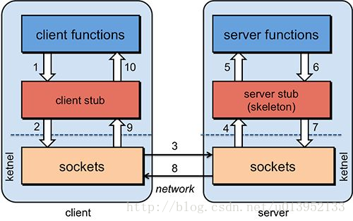
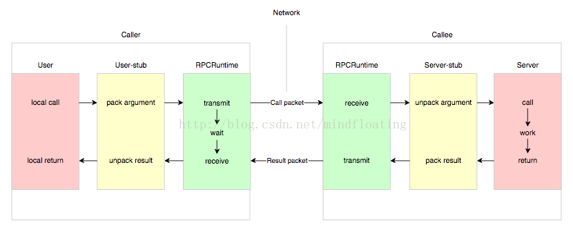
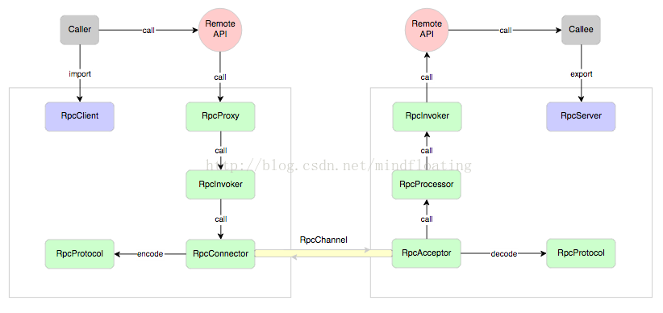
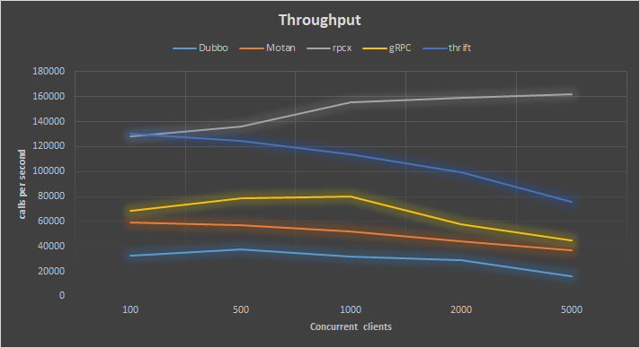
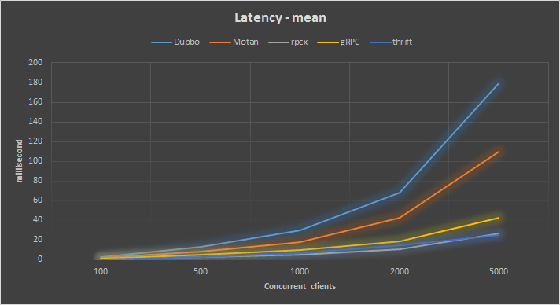
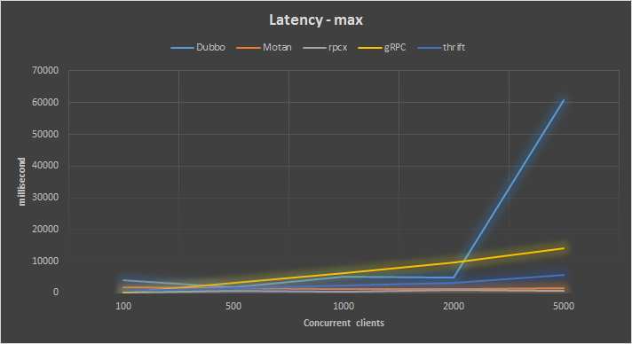
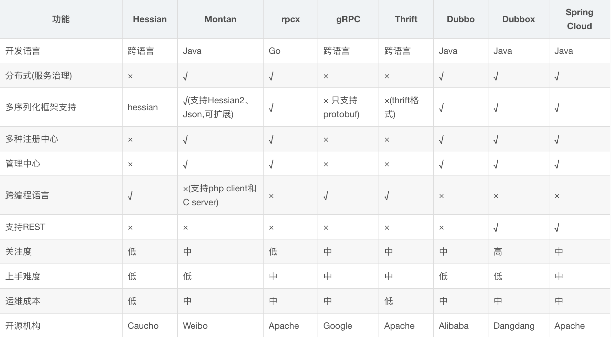

## RPC 简介

- [一、前言](#前言)
- [二、RPC工作原理](#RPC工作原理)
- [三、常用的分布式RPC框架](#常用的分布式RPC框架)
- [四、RPC各个框架对比](#RPC各个框架对比)

### 前言

**1. 关于RPC框架，首先我们要了解什么叫RPC ？为什么要使用RPC？**

RPC（remote procedure call）是指远程过程调用，比如两台服务器A和B，A服务器上部署一个应用，B服务器上部署一个应用，
A服务器上的应用想调用B服务器上的应用提供的接口，由于不在一个内存空间，不能直接调用，所以需要通过网络来表达调用的语义和传达调用的数据。

### RPC工作原理
如下图所示：

这里 user 就是 client 端，当 user 想发起一个远程调用时，它实际是通过本地调用user-stub。
user-stub 负责将调用的接口、方法和参数通过约定的协议规范进行编码并通过本地的 RPCRuntime 实例传输到远端的实例。
远端 RPCRuntime 实例收到请求后交给 server-stub 进行解码后发起本地端调用，调用结果再返回给 user 端

整个过程可以用下图进行描述：

**RPC框架中主要有哪几个关键步骤呢？**

- **首先，要解决通讯的问题**，主要是通过客户端和服务器端之间建立TCP连接，远程过程调用的所有交换的数据都在这个连接里传输。
  连接可以是按需连接，调用结束后就断掉，也可以是长连接，多个远程过程调用共享一个连接。
  
- **第二，要解决寻址的问题**，A服务器上的应用要调用B服务器上的应用，A服务器上的应用需要通过底层RPC框架得知：
  如何连接到B服务器（主机或IP地址）以及特定的端口，方法的名称等信息，这样才能完成调用。
  
- **第三，数据序列化**，A服务器上的应用发起远程调用时，方法的参数需要通过底层的网络协议如TCP传递到B服务器，
  由于网络协议是基于二进制的，内存中的参数需要序列化成二进制形式，然后再通过寻址和传输将序列化的二进制发送给B服务器。
  
- **第四，接收数据反序列化**，B服务器收到请求后，需要进行反序列化，恢复为内存中的表达方式，然后找到对应的方法进行本地调用并返回，
  序列化返回值并发送给A服务器。
  
- **第五，数据返回反序列化**，A服务器收到B服务器的返回值后，进行反序列化，恢复为内存中的表达方式，
  然后交给A服务器上的应用进行处理。
  
  

### 常用的分布式RPC框架

**Dubbo** 

Dubbo是阿里巴巴公司开源的一个Java高性能优秀的服务框架，使得应用可通过高性能的 RPC 实现服务的输出和输入功能，
可以和 Spring框架无缝集成。

**Motan**

Motan是新浪微博开源的一个Java 框架。它诞生的比较晚，起于2013年，2016年5月开源。Motan 在微博平台中已经广泛应用，
每天为数百个服务完成近千亿次的调用。

**rpcx**

rpcx 是Go语言生态圈的Dubbo， 比Dubbo更轻量，实现了Dubbo的许多特性，借助于Go语言优秀的并发特性和简洁语法，
可以使用较少的代码实现分布式的RPC服务。

**gRPC**

gRPC 是Google开发的高性能、通用的开源RPC框架，其由Google主要面向移动应用开发并基于HTTP/2协议标准而设计，
基于ProtoBuf(Protocol Buffers)序列化协议开发，且支持众多开发语言。本身它不是分布式的，所以要实现上面的框架的功能需要进一步的开发。

**thrift**

thrift 是Apache的一个跨语言的高性能的服务框架，也得到了广泛的应用。

**Hessian**

Hessian 采用的是二进制RPC协议，适用于发送二进制数据。但本身也是一个Web Service框架对RPC调用提供支持，
功能简单，使用起来也方便。基于Http协议进行传输。通过Servlet提供远程服务。通过Hessain本身提供的API来发起请求。
响应端根据Hessian提供的API来接受请求。

### RPC各个框架对比

对以上几个常用的RPC框架进行压测

测试将用吞吐率、相应时间平均值、响应时间中位数、响应时间最大值进行比较

分别在client并发数为100、500、1000、2000 和 5000的情况下测试

#### 压测结果 -- 吞吐量

- rpcx的性能遥遥领先，并且其它三种框架在并发client很大的情况下吞吐率会下降。
- thrift比rpcx性能差一点，但是还不错，远好于gRPC,dubbo和motan,但是随着client的增多，性能也下降的很厉害，
  在client较少的情况下吞吐率挺好。

#### 压测结果 -- 平均响应时间

- 这个和吞吐率的表现是一致的，还是rpcx最好，平均响应时间小于30ms, 
- Dubbo在并发client多的情况下响应时间很长

#### 压测结果 -- 最大响应时间

rpcx的最大响应时间都小于1秒，Motan的表现也不错，都小于2秒，其它两个框架表现不是太好

#### 分布式RPC框架性能大比拼 dubbo、motan、rpcx、gRPC、thrift的性能比较

