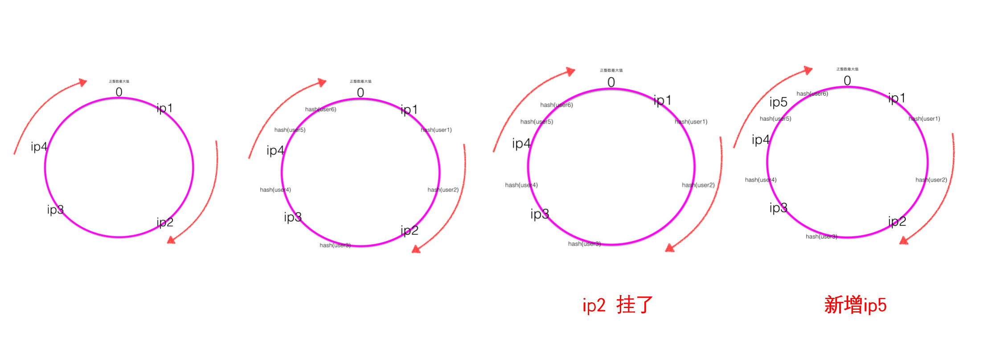
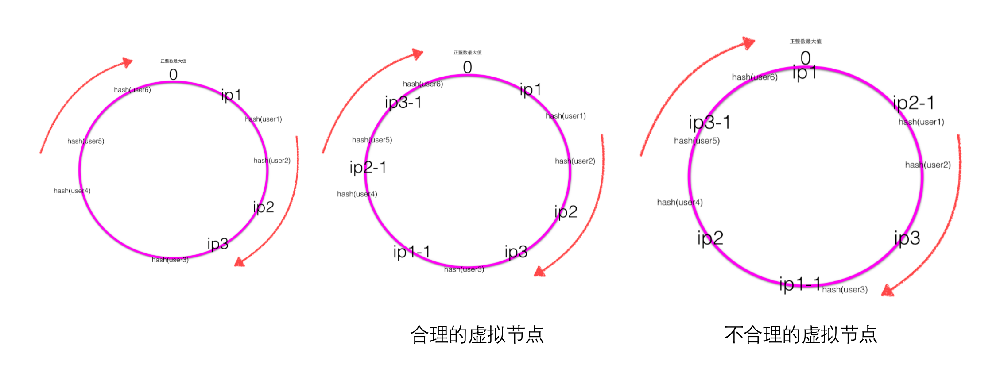

## DUBBO 源码学习

- [一、服务是如何发布的](#服务是如何发布的) 
    - [1.1 ServiceBean类](#ServiceBean类)  
    - [1.2 ServiceConfig类](#ServiceConfig类)  
    - [1.3 DubboProtocol类](#DubboProtocol类)  
    - [1.4 RegistryProtocol类](#RegistryProtocol类)  
    - [1.5 暴露服务时序图](#暴露服务时序图)  
- [二、服务是如何引用的](#服务是如何引用的)
    - [2.1 ReferenceBean类](#ReferenceBean类)   
    - [2.2 RegistryProtocol类](#RegistryProtocol类)   
    - [2.3 引用服务时序](#引用服务时序)   
- [三、注册中心分析](#注册中心分析)
    - [3.1 注册中心](#注册中心)  
    - [3.2 源码](#源码)  
    - [3.3 RegistryService接口](#RegistryService接口)  
    - [3.4 AbstractRegistry抽象类](#AbstractRegistry抽象类)  
    - [3.5 FailbackRegistry抽象类](#FailbackRegistry抽象类)  
- [四、集群负载均衡算法的实现](#集群负载均衡算法的实现)
- [五、优雅停机原理及在SpringBoot中遇到的问题](#优雅停机原理及在SpringBoot中遇到的问题)
    - [5.1 前言](#前言)  
    - [5.2 优雅停机原理](#优雅停机原理)  


### 服务是如何发布的

#### ServiceBean类

ServiceBean 实现ApplicationListener接口监听ContextRefreshedEvent事件(容器加载完成事件)
```java
    public void onApplicationEvent(ApplicationEvent event) {
        if (ContextRefreshedEvent.class.getName().equals(event.getClass().getName())) {
            if (isDelay() && ! isExported() && ! isUnexported()) {
                if (logger.isInfoEnabled()) {
                    logger.info("The service ready on spring started. service: " + getInterface());
                }
                export();
            }
        }
    }
```
   
在容器加载完成后执行export(); 开始暴露

#### ServiceConfig类

**方法执行顺序：export() -> doExport() -> doExportUrls() -> doExportUrlsFor1Protocol();**

***export()：*** 判断是否延迟发布，如果延迟发布会新建个(守护线程)Daemon[ˈdiːmən]线程然后调用doExport(), 否则直接调用doExport()；

***doExport()：*** 给ServiceConfig 装载注册中心监控中心等。

***doExportUrls():***

```java
    private void doExportUrls() {
        List<URL> registryURLs = loadRegistries(true);
        for (ProtocolConfig protocolConfig : protocols) {
            doExportUrlsFor1Protocol(protocolConfig, registryURLs);
        }
    }
```
1. 执行loadRegistries()遍历注册中心，根据注册中心、Dubbo版本、Pid等 生成要发布的URL;
   URL示例： zookeeper://127.0.0.1:2181/com.alibaba.dubbo.registry.RegistryService?application=ordercenter_serviceImpl
   &dubbo=2.8.4&pid=15836&registry=zookeeper&timestamp=1484018365125
2. 遍历服务协议，为每个协议执行doExportUrlsFor1Protocol()

***doExportUrlsFor1Protocol()***
```java
Invoker<?> invoker = proxyFactory.getInvoker(ref, (Class) interfaceClass, registryURL.addParameterAndEncoded(Constants.EXPORT_KEY, url.toFullString()));
Exporter<?> exporter = protocol.export(invoker);
```
1. 创建 Invoker
2. 调用 protocol.export() 将Invoker 转换成Exporter


#### DubboProtocol类
**方法执行顺序：export() -> openServer() ->createServer()**

createServer() 通过Exchangers.bind() 创建 ExchangeServer

#### RegistryProtocol类

DubboProtocol export() 执行完成后最终返回上层包装类 RegistryProtocol类

RegistryProtocol export() 进行服务注册和变更订阅
```java
    public <T> Exporter<T> export(final Invoker<T> originInvoker) throws RpcException {
        //export invoker
        final ExporterChangeableWrapper<T> exporter = doLocalExport(originInvoker);
        //registry provider
        final Registry registry = getRegistry(originInvoker);
        final URL registedProviderUrl = getRegistedProviderUrl(originInvoker);
        registry.register(registedProviderUrl);
        // 订阅override数据
        // FIXME 提供者订阅时，会影响同一JVM即暴露服务，又引用同一服务的的场景，因为subscribed以服务名为缓存的key，导致订阅信息覆盖。
        final URL overrideSubscribeUrl = getSubscribedOverrideUrl(registedProviderUrl);
        final OverrideListener overrideSubscribeListener = new OverrideListener(overrideSubscribeUrl);
        overrideListeners.put(overrideSubscribeUrl, overrideSubscribeListener);
        registry.subscribe(overrideSubscribeUrl, overrideSubscribeListener);
        //....
    }
```
    
#### 暴露服务时序图


----

### 服务是如何引用的

#### ReferenceBean类

跟服务引用一样，Dubbo的reference配置会被转成ReferenceBean类,ReferenceBean实现了InitializingBean接口，直接看afterPropertiesSet()也就是spring为Bean提供的初始化方法

***方法调用顺序afterPropertiesSet() -> getObject() -> get() -> init() -> createProxy()***


##### afterPropertiesSet()

afterPropertiesSet()作用为装载应用信息、注册、模块、监控等配置，然后调用getObject()
```java
    public void afterPropertiesSet() throws Exception {
        //.....
        setApplication(applicationConfig);
        //.....
        setModule(moduleConfig);
        //.....
        super.setRegistries(registryConfigs);
        //.....
        Boolean b = isInit();
        if (b == null && getConsumer() != null) {
            b = getConsumer().isInit();
        }
        if (b != null && b.booleanValue()) {
            getObject();
        }
    }
```
    
##### getObject()
getObject() 返回 get() 执行结果
```java
    public Object getObject() throws Exception {
        return get();
    }
```
    
##### get()
get() 如果接口代理类（ref) 为空则调用 init() 生成接口代理类
```java
    public synchronized T get() {
        if (destroyed){
            throw new IllegalStateException("Already destroyed!");
        }
        if (ref == null) {
            init();
        }
        return ref;
    }
```
##### init()
init() 根据配置生成Map 然后调用 createProxy() 生成代理类


```java
    ref = createProxy(map);
```

##### createProxy()
具体作用见注释
```java
    private T createProxy(Map<String, String> map) {
        //1. 创建临时Url
        URL tmpUrl = new URL("temp", "localhost", 0, map);
        final boolean isJvmRefer;
        // 省略部分代码.....
        //2.判断是否暴漏本地服务
        if (isJvmRefer) {
            URL url = new URL(Constants.LOCAL_PROTOCOL, NetUtils.LOCALHOST, 0, interfaceClass.getName()).addParameters(map);
            invoker = refprotocol.refer(interfaceClass, url);
        // 省略部分代码.....
        } else {
            //3.判断用户指定URL，指定的URL可能是对点对直连地址，也可能是注册中心URL
            if (url != null && url.length() > 0) { 
                String[] us = Constants.SEMICOLON_SPLIT_PATTERN.split(url);
                if (us != null && us.length > 0) {
                    for (String u : us) {
                        URL url = URL.valueOf(u);
                        if (url.getPath() == null || url.getPath().length() == 0) {
                            url = url.setPath(interfaceName);
                        }
                        if (Constants.REGISTRY_PROTOCOL.equals(url.getProtocol())) {
                            urls.add(url.addParameterAndEncoded(Constants.REFER_KEY, StringUtils.toQueryString(map)));
                        } else {
                            urls.add(ClusterUtils.mergeUrl(url, map));
                        }
                    }
                }
            } else { 
                //4. 通过注册中心配置拼装URL
                List<URL> us = loadRegistries(false);
                if (us != null && us.size() > 0) {
                    for (URL u : us) {
                        URL monitorUrl = loadMonitor(u);
                        if (monitorUrl != null) {
                            map.put(Constants.MONITOR_KEY, URL.encode(monitorUrl.toFullString()));
                        }
                        urls.add(u.addParameterAndEncoded(Constants.REFER_KEY, StringUtils.toQueryString(map)));
                    }
                }
                if (urls == null || urls.size() == 0) {
                    throw new IllegalStateException("No such any registry to reference " + interfaceName  + " on the consumer " + NetUtils.getLocalHost() + " use dubbo version " + Version.getVersion() + ", please config <dubbo:registry address=\"...\" /> to your spring config.");
                }
            }
            // 5.调用refprotocol.refer()
            if (urls.size() == 1) {
                invoker = refprotocol.refer(interfaceClass, urls.get(0));
            } else {
                List<Invoker<?>> invokers = new ArrayList<Invoker<?>>();
                URL registryURL = null;
                for (URL url : urls) {
                    invokers.add(refprotocol.refer(interfaceClass, url));
                    if (Constants.REGISTRY_PROTOCOL.equals(url.getProtocol())) {
                        registryURL = url; // 用了最后一个registry url
                    }
                }
                if (registryURL != null) { // 有 注册中心协议的URL
                    // 对有注册中心的Cluster 只用 AvailableCluster
                    URL u = registryURL.addParameter(Constants.CLUSTER_KEY, AvailableCluster.NAME); 
                    invoker = cluster.join(new StaticDirectory(u, invokers));
                }  else { // 不是 注册中心的URL
                    invoker = cluster.join(new StaticDirectory(invokers));
                }
            }
        }
        // 省略.....
        // 6.创建服务代理
        return (T) proxyFactory.getProxy(invoker);
    }
```

#### RegistryProtocol
**refprotocol.refer()**

refprotocol.refer() 先后经过修饰类 ProtocolFilterWrapper、ProtocolListenerWrapper 最后执行RegistryProtocol

***ProtocolFilterWrapper -> ProtocolListenerWrapper***
```java
    //ProtocolFilterWrapper
    public <T> Invoker<T> refer(Class<T> type, URL url) throws RpcException {
        if (Constants.REGISTRY_PROTOCOL.equals(url.getProtocol())) {
            return protocol.refer(type, url);
        }
        return buildInvokerChain(protocol.refer(type, url), Constants.REFERENCE_FILTER_KEY, Constants.CONSUMER);
    }
    
    //ProtocolListenerWrapper
    public <T> Invoker<T> refer(Class<T> type, URL url) throws RpcException {
        if (Constants.REGISTRY_PROTOCOL.equals(url.getProtocol())) {
            return protocol.refer(type, url);
        }
        return new ListenerInvokerWrapper<T>(protocol.refer(type, url), 
                Collections.unmodifiableList(
                        ExtensionLoader.getExtensionLoader(InvokerListener.class)
                        .getActivateExtension(url, Constants.INVOKER_LISTENER_KEY)));
    }
```

##### RegistryProtocol
```java
    @SuppressWarnings("unchecked")
    public <T> Invoker<T> refer(Class<T> type, URL url) throws RpcException {
        // Constants.REGISTRY_KEY: registry 
        // Constants.DEFAULT_REGISTRY: dubbo
        url = url.setProtocol(url.getParameter(Constants.REGISTRY_KEY, Constants.DEFAULT_REGISTRY)).removeParameter(Constants.REGISTRY_KEY);
        Registry registry = registryFactory.getRegistry(url);
        if (RegistryService.class.equals(type)) {
            return proxyFactory.getInvoker((T) registry, type, url);
        }
        // 配置Group信息
        // group="a,b" or group="*"
        Map<String, String> qs = StringUtils.parseQueryString(url.getParameterAndDecoded(Constants.REFER_KEY)); // Constants.REFER_KEY:refer
        String group = qs.get(Constants.GROUP_KEY);
        if (group != null && group.length() > 0 ) {
            if ( ( Constants.COMMA_SPLIT_PATTERN.split( group ) ).length > 1
                    || "*".equals( group ) ) {
                return doRefer( getMergeableCluster(), registry, type, url );
            }
        }
        return doRefer(cluster, registry, type, url);
    }
```  
    
##### doRefer()
调用FailbackRegistry.register() 在注册中心注册消费者subscribeUrl

调用FailbackRegistry.subscribe() 订阅注册中心subscribeUrl

```java

    private <T> Invoker<T> doRefer(Cluster cluster, Registry registry, Class<T> type, URL url) {
        RegistryDirectory<T> directory = new RegistryDirectory<T>(type, url);
        directory.setRegistry(registry);
        directory.setProtocol(protocol);
        // Constants.CONSUMER_PROTOCOL: consumer
        URL subscribeUrl = new URL(Constants.CONSUMER_PROTOCOL, NetUtils.getLocalHost(), 0, type.getName(), directory.getUrl().getParameters());
        
        //consumer://10.9.22.12/com.**.ShopService?application=test&check=false&dubbo=2.8.4
        //&interface=com.**.ShopService&methods=getList&pid=6168&retries=1&revision=1.0-SNAPSHOT
        //&side=consumer&timeout=6000&timestamp=1484275807134&version=1.0
        if (! Constants.ANY_VALUE.equals(url.getServiceInterface())
                && url.getParameter(Constants.REGISTER_KEY, true)) {
            registry.register(subscribeUrl.addParameters(Constants.CATEGORY_KEY, Constants.CONSUMERS_CATEGORY,
                    Constants.CHECK_KEY, String.valueOf(false)));
        }
        directory.subscribe(subscribeUrl.addParameter(Constants.CATEGORY_KEY, 
                Constants.PROVIDERS_CATEGORY 
                + "," + Constants.CONFIGURATORS_CATEGORY 
                + "," + Constants.ROUTERS_CATEGORY));
        return cluster.join(directory);
    }
```
#### 引用服务时序


----

### 注册中心分析

#### 注册中心
关于注册中心，Dubbo提供了多个实现方式，有比较成熟的使用zookeeper 和 redis 的实现，也有实验性质的Multicast实现。

Zookeeper是Apacahe Hadoop的子项目，是一个树型的目录服务，支持变更推送，适合作为Dubbo服务的注册中心，工业强度较高，可用于生产环境，

所以Zookeeper注册中心也是Dubbo推荐使用也是使用度比较高的注册中心。

Zookeeper注册中心支持以下功能：
    
    当提供者出现断电等异常停机时，注册中心能自动删除提供者信息。
    当注册中心重启时，能自动恢复注册数据，以及订阅请求。
    当会话过期时，能自动恢复注册数据，以及订阅请求。
    当设置 check="false" 时，记录失败注册和订阅请求，后台定时重试。
    可通过 username="admin" password="1234" 设置zookeeper登录信息。
    可通过 group="dubbo" 设置zookeeper的根节点，不设置将使用无根树。
    支持号通配符 group="" version="*" ，可订阅服务的所有分组和所有版本的提供者。

#### 源码

zookeeper注册中心的源码为com.alibaba.dubbo.registry.zookeeper.ZookeeperRegistry。

ZookeeperRegistry 类继承自 FailbackRegistry，FailbackRegistry 又继承自 AbstractRegistry，AbstractRegistry实现了 RegistryService 接口。

因此我们阅读源码顺序为：***RegistryService -> AbstractRegistry -> FailbackRegistry -> ZookeeperRegistry***

#### RegistryService接口

关于RegistryService接口RegistryService，Dubbo提供了详细的注释。

```java
public interface RegistryService {

    /**
     * 注册数据，比如：提供者地址，消费者地址，路由规则，覆盖规则，等数据。
     * 
     * 注册需处理契约：<br>
     * 1. 当URL设置了check=false时，注册失败后不报错，在后台定时重试，否则抛出异常。<br>
     * 2. 当URL设置了dynamic=false参数，则需持久存储，否则，当注册者出现断电等情况异常退出时，需自动删除。<br>
     * 3. 当URL设置了category=routers时，表示分类存储，缺省类别为providers，可按分类部分通知数据。<br>
     * 4. 当注册中心重启，网络抖动，不能丢失数据，包括断线自动删除数据。<br>
     * 5. 允许URI相同但参数不同的URL并存，不能覆盖。<br>
     * 
     * @param url 注册信息，不允许为空，如：dubbo://10.20.153.10/com.alibaba.foo.BarService?version=1.0.0&application=kylin
     */
    void register(URL url);

    /**
     * 取消注册.
     * 
     * 取消注册需处理契约：<br>
     * 1. 如果是dynamic=false的持久存储数据，找不到注册数据，则抛IllegalStateException，否则忽略。<br>
     * 2. 按全URL匹配取消注册。<br>
     * 
     * @param url 注册信息，不允许为空，如：dubbo://10.20.153.10/com.alibaba.foo.BarService?version=1.0.0&application=kylin
     */
    void unregister(URL url);

    /**
     * 订阅符合条件的已注册数据，当有注册数据变更时自动推送.
     * 
     * 订阅需处理契约：<br>
     * 1. 当URL设置了check=false时，订阅失败后不报错，在后台定时重试。<br>
     * 2. 当URL设置了category=routers，只通知指定分类的数据，多个分类用逗号分隔，并允许星号通配，表示订阅所有分类数据。<br>
     * 3. 允许以interface,group,version,classifier作为条件查询，如：interface=com.alibaba.foo.BarService&version=1.0.0<br>
     * 4. 并且查询条件允许星号通配，订阅所有接口的所有分组的所有版本，或：interface=*&group=*&version=*&classifier=*<br>
     * 5. 当注册中心重启，网络抖动，需自动恢复订阅请求。<br>
     * 6. 允许URI相同但参数不同的URL并存，不能覆盖。<br>
     * 7. 必须阻塞订阅过程，等第一次通知完后再返回。<br>
     * 
     * @param url 订阅条件，不允许为空，如：consumer://10.20.153.10/com.alibaba.foo.BarService?version=1.0.0&application=kylin
     * @param listener 变更事件监听器，不允许为空
     */
    void subscribe(URL url, NotifyListener listener);

    /**
     * 取消订阅.
     * 
     * 取消订阅需处理契约：<br>
     * 1. 如果没有订阅，直接忽略。<br>
     * 2. 按全URL匹配取消订阅。<br>
     * 
     * @param url 订阅条件，不允许为空，如：consumer://10.20.153.10/com.alibaba.foo.BarService?version=1.0.0&application=kylin
     * @param listener 变更事件监听器，不允许为空
     */
    void unsubscribe(URL url, NotifyListener listener);

    /**
     * 查询符合条件的已注册数据，与订阅的推模式相对应，这里为拉模式，只返回一次结果。
     * 
     * @see com.alibaba.dubbo.registry.NotifyListener#notify(List)
     * @param url 查询条件，不允许为空，如：consumer://10.20.153.10/com.alibaba.foo.BarService?version=1.0.0&application=kylin
     * @return 已注册信息列表，可能为空，含义同{@link com.alibaba.dubbo.registry.NotifyListener#notify(List<URL>)}的参数。
     */
    List<URL> lookup(URL url);

}
```
#### AbstractRegistry抽象类

从构造函数可以看出 AbstractRegistry 抽象类主要是提供了对注册中心数据的文件缓存。
```java
    String filename = url.getParameter(Constants.FILE_KEY, System.getProperty("user.home") + "/.dubbo/dubbo-registry-" + url.getHost() + ".cache");
    File file = null;
    if (ConfigUtils.isNotEmpty(filename)) {
        file = new File(filename);
        if(! file.exists() && file.getParentFile() != null && ! file.getParentFile().exists()){
            if(! file.getParentFile().mkdirs()){
                throw new IllegalArgumentException("Invalid registry store file " + file + ", cause: Failed to create directory " + file.getParentFile() + "!");
            }
        }
    }
```
Dubbo会在用户目录创建./dubbo文件夹及缓存文件，以windows为例，生成的缓存文件为：C:\Users\你的登录用户名/.dubbo/dubbo-registry-127.0.0.1.cache

#### FailbackRegistry抽象类

FailbackRegistry 顾名思义是主要提供的是失败自动恢复，同样看一下构造函数，在构造函数中会通过 ScheduledExecutorService 一直执行Retry方法进行重试。

```java
    public FailbackRegistry(URL url) {
        super(url);
        int retryPeriod = url.getParameter(Constants.REGISTRY_RETRY_PERIOD_KEY, Constants.DEFAULT_REGISTRY_RETRY_PERIOD);
        this.retryFuture = retryExecutor.scheduleWithFixedDelay(new Runnable() {
            public void run() {
                try {
                    retry();
                } catch (Throwable t) { 
                    logger.error("Unexpected error occur at failed retry, cause: " + t.getMessage(), t);
                }
            }
        }, retryPeriod, retryPeriod, TimeUnit.MILLISECONDS);
    }
```
retry()方法主要的从各个操作中的失败列表取出失败的操作进行重试。

```java
  protected void retry() {
        if (! failedRegistered.isEmpty()) {
            Set<URL> failed = new HashSet<URL>(failedRegistered);
            if (failed.size() > 0) {
                if (logger.isInfoEnabled()) {
                    logger.info("Retry register " + failed);
                }
                try {
                    for (URL url : failed) {
                        try {
                            doRegister(url);
                            failedRegistered.remove(url);
                        } catch (Throwable t) { // 忽略所有异常，等待下次重试
                            logger.warn("Failed to retry register " + failed + ", waiting for again, cause: " + t.getMessage(), t);
                        }
                    }
                } catch (Throwable t) { // 忽略所有异常，等待下次重试
                    logger.warn("Failed to retry register " + failed + ", waiting for again, cause: " + t.getMessage(), t);
                }
            }
        }
        if(! failedUnregistered.isEmpty()) {
             //......
             doUnregister(url);
             failedUnregistered.remove(url);
             //.....
        }
        if (! failedSubscribed.isEmpty()) {
             //.....
        }
        if (! failedUnsubscribed.isEmpty()) {
            //.......
        }
        if (! failedNotified.isEmpty()) {
            //.......
        }
    }
```
同时提供了几个抽象方法
```java
    public abstract void doRegister(URL url);

    public abstract void doUnregister(URL url);

    public abstract void doSubscribe(URL url, NotifyListener listener);

    public abstract void doUnsubscribe(URL url, NotifyListener listener);
```

#### ZookeeperRegistry类


ZookeeperRegistry流程

    服务提供者启动时
    向/dubbo/com.foo.BarService/providers目录下写入自己的URL地址。
    
    服务消费者启动时
    订阅/dubbo/com.foo.BarService/providers目录下的提供者URL地址。
    并向/dubbo/com.foo.BarService/consumers目录下写入自己的URL地址。
    
    监控中心启动时
    订阅/dubbo/com.foo.BarService目录下的所有提供者和消费者URL地址。

ZookeeperRegistry 主要是实现了FailbackRegistry的那几个抽象方法。本次也主要分析 doRegister(),doSubscribe()这两个方法。

##### doRegister()
```java
    protected void doRegister(URL url) {
        try {
            zkClient.create(toUrlPath(url), url.getParameter(Constants.DYNAMIC_KEY, true));
        } catch (Throwable e) {
            throw new RpcException("Failed to register " + url + " to zookeeper " + getUrl() + ", cause: " + e.getMessage(), e);
        }
    }

    public void create(String path, boolean ephemeral) {
        int i = path.lastIndexOf('/');
        if (i > 0) {
            create(path.substring(0, i), false);
        }
        if (ephemeral) {
            createEphemeral(path);
        } else {
            createPersistent(path);
        }
    }
}
```
doRegister() 主要是调用zkClient创建一个节点。 create（）以递归的方式创建节点，通过判断Url中dynamic=false 判断创建的是持久化节点还是临时节点。

创建的结果为：


##### doSubscribe()
doSubscribe() 订阅Zookeeper节点是通过创建ChildListener来实现的具体调用的方法是 addChildListener()

addChildListener()又调用 AbstractZookeeperClient.addTargetChildListener()然后调用subscribeChildChanges()

最后调用ZkclientZookeeperClient ZkClientd.watchForChilds()
```java
    protected void doSubscribe(final URL url, final NotifyListener listener) {
        //....
        List<String> children = zkClient.addChildListener(path, zkListener);
        //.....
    }
    public List<String> addChildListener(String path, final ChildListener listener) {
        //......
        return addTargetChildListener(path, targetListener);
    }
    ```java
    public List<String> addTargetChildListener(String path, final IZkChildListener listener) {
        return client.subscribeChildChanges(path, listener);
    }
    public List<String> subscribeChildChanges(String path, IZkChildListener listener) {
        //.....
        return watchForChilds(path);
    }
```
    
### 集群负载均衡算法的实现

#### 负载均衡前言

Dubbo 的定位是分布式服务框架，为了避免单点压力过大，服务的提供者通常部署多台，如何从服务提供者集群中选取一个进行调用，就依赖于Dubbo的负载均衡策略。

#### Dubbo 负载均衡策略

Dubbo 负载均衡策略提供下列四种方式：

**Random LoadBalance 随机**

    随机，按权重设置随机概率。 Dubbo的默认负载均衡策略
    在一个截面上碰撞的概率高，但调用量越大分布越均匀，而且按概率使用权重后也比较均匀，有利于动态调整提供者权重。

**RoundRobin LoadBalance 轮循**

    轮循，按公约后的权重设置轮循比率。
    存在慢的提供者累积请求问题，比如：第二台机器很慢，但没挂，当请求调到第二台时就卡在那，久而久之，所有请求都卡在调到第二台上。

**LeastActive LoadBalance 最少活跃调用数**
    
    最少活跃调用数，相同活跃数的随机，活跃数指调用前后计数差。
    使慢的提供者收到更少请求，因为越慢的提供者的调用前后计数差会越大。

**ConsistentHash LoadBalance 一致性Hash**

    一致性Hash，相同参数的请求总是发到同一提供者。
    当某一台提供者挂时，原本发往该提供者的请求，基于虚拟节点，平摊到其它提供者，不会引起剧烈变动。

#### 负载均衡源码

#### LoadBalance

首先查看 LoadBalance 接口
```java
Invoker select(List<Invoker> invokers, URL url, Invocation invocation) throws RpcException;
```

LoadBalance 定义了一个方法就是从 invokers 列表中选取一个invoker

#### AbstractLoadBalance
AbstractLoadBalance 抽象类是所有负载均衡策略实现类的父类，实现了LoadBalance接口 的方法，同时提供抽象方法doSelect交由子类实现，
```java
 public <T> Invoker<T> select(List<Invoker<T>> invokers, URL url, Invocation invocation) {
        if (invokers == null || invokers.size() == 0)
            return null;
        if (invokers.size() == 1)
            return invokers.get(0);
        return doSelect(invokers, url, invocation);
}
protected abstract <T> Invoker<T> doSelect(List<Invoker<T>> invokers, URL url, Invocation invocation);
```

#### RandomLoadBalance
```java
    protected <T> Invoker<T> doSelect(List<Invoker<T>> invokers, URL url, Invocation invocation) {
        int length = invokers.size();
        int totalWeight = 0; 
        boolean sameWeight = true; 
        for (int i = 0; i < length; i++) {
            int weight = getWeight(invokers.get(i), invocation);
            totalWeight += weight; 
            if (sameWeight && i > 0
                    && weight != getWeight(invokers.get(i - 1), invocation)) {
                sameWeight = false; 
            }
        }
        if (totalWeight > 0 && ! sameWeight) {
            int offset = random.nextInt(totalWeight);
            for (int i = 0; i < length; i++) {
                offset -= getWeight(invokers.get(i), invocation);
                if (offset < 0) {
                    return invokers.get(i);
                }
            }
        }
        return invokers.get(random.nextInt(length));
    }
```  

RandomLoadBalance 实现很简单，如果每个提供者的权重都相同，那么根据列表长度直接随机选取一个，
如果权重不同，累加权重值。根据0~累加的权重值 选取一个随机数，然后判断该随机数落在那个提供者上。

示例：

    假定有3台dubbo provider: 
    10.0.0.1:20884, weight=2； 
    10.0.0.2:20886, weight=3 ；
    10.0.0.3:20888, weight=4 
    
    随机算法的实现： totalWeight=9; 假设offset=1（即random.nextInt(9)=1） 1-2=-1<0？是，所以选中 10.0.0.1:20884, weight=2
    假设offset=4（即random.nextInt(9)=4） 4-2=2<0？否，这时候offset=2， 2-3<0？是，所以选中 10.0.0.2:20886, weight=3
    假设offset=7（即random.nextInt(9)=7） 7-2=5<0？否，这时候offset=5， 5-3=2<0？否，这时候offset=2， 2-4<0？是，所以选中 10.0.0.3:20888, weight=4


#### RoundRobinLoadBalance
轮询算法
```java
    private final ConcurrentMap<String, AtomicPositiveInteger> sequences = new ConcurrentHashMap<String, AtomicPositiveInteger>();
    private final ConcurrentMap<String, AtomicPositiveInteger> weightSequences = new ConcurrentHashMap<String, AtomicPositiveInteger>();

    protected <T> Invoker<T> doSelect(List<Invoker<T>> invokers, URL url, Invocation invocation) {
        String key = invokers.get(0).getUrl().getServiceKey() + "." + invocation.getMethodName();
        int length = invokers.size(); 
        int maxWeight = 0; 
        int minWeight = Integer.MAX_VALUE; 
        for (int i = 0; i < length; i++) {
            int weight = getWeight(invokers.get(i), invocation);
            maxWeight = Math.max(maxWeight, weight); 
            minWeight = Math.min(minWeight, weight); 
        }
        if (maxWeight > 0 && minWeight < maxWeight) { 
            AtomicPositiveInteger weightSequence = weightSequences.get(key);
            if (weightSequence == null) {
                weightSequences.putIfAbsent(key, new AtomicPositiveInteger());
                weightSequence = weightSequences.get(key);
            }
            int currentWeight = weightSequence.getAndIncrement() % maxWeight;
            List<Invoker<T>> weightInvokers = new ArrayList<Invoker<T>>();
            for (Invoker<T> invoker : invokers) { 
                if (getWeight(invoker, invocation) > currentWeight) {
                    weightInvokers.add(invoker);
                }
            }
            int weightLength = weightInvokers.size();
            if (weightLength == 1) {
                return weightInvokers.get(0);
            } else if (weightLength > 1) {
                invokers = weightInvokers;
                length = invokers.size();
            }
        }
        AtomicPositiveInteger sequence = sequences.get(key);
        if (sequence == null) {
            sequences.putIfAbsent(key, new AtomicPositiveInteger());
            sequence = sequences.get(key);
        }
        return invokers.get(sequence.getAndIncrement() % length);
    }
```
首先也是判断权重是否一致，如果一致，通过维护一个 AtomicInteger 的增长 进行取模乱来轮训。
如果权重不一致，通过维护一个 AtomicInteger的增长与最大权重取模作为当前权重，然后获取大于当前权重的列表作为调用者列表，然后进行取模轮训

示例：

    假定有3台权重都一样的dubbo provider: 
    10.0.0.1:20884, weight=5 ；
    10.0.0.2:20886, weight=3 ；
    10.0.0.3:20888, weight=4 ； 
    轮询算法的实现： 
    
    找出活跃的权重最大的服务提供者为目标服务提供者
    第一次轮询，maxCurrent=5，选择 10.0.0.1:20884
    第二次轮询，maxCurrent=8 (4+4)，选择 10.0.0.3:20888
    第三次轮询，maxCurrent=10 (5+5)，选择 10.0.0.1:20884
    第四次轮询，maxCurrent=12 (3+3+3+3)，选择 10.0.0.2:20886


#### LeastActiveLoadBalance
LeastActiveLoadBalance 源码比较简单就不列出了，思路主要是，获取最小的活跃数，把活跃数等于最小活跃数的调用者维护成一个数组

如果权重一致随机取出，如果不同则跟 RandomLoadBalance 一致，累加权重，然后随机取出。

示例：

    最小活跃数算法实现： 
    假定有3台dubbo provider: 
    10.0.0.1:20884, weight=2，active=2 
    10.0.0.2:20886, weight=3，active=4 
    10.0.0.3:20888, weight=4，active=3 
    active=2最小，且只有一个2，所以选择10.0.0.1:20884
    
    假定有3台dubbo provider: 
    10.0.0.1:20884, weight=2，active=2 
    10.0.0.2:20886, weight=3，active=2 
    10.0.0.3:20888, weight=4，active=3 
    active=2最小，且有2个，所以从[10.0.0.1:20884,10.0.0.2:20886 ]中选择； 
    
    接下来的算法与随机算法类似： 
    假设offset=1（即random.nextInt(5)=1） 1-2=-1<0？是，所以选中 10.0.0.1:20884, weight=2 
    假设offset=4（即random.nextInt(5)=4） 4-2=2<0？否，这时候offset=2， 2-3<0？是，所以选中 10.0.0.2:20886, weight=3


#### ConsistentHashLoadBalance
```java
    protected <T> Invoker<T> doSelect(List<Invoker<T>> invokers, URL url, Invocation invocation) {
        String key = invokers.get(0).getUrl().getServiceKey() + "." + invocation.getMethodName();
        int identityHashCode = System.identityHashCode(invokers);
        ConsistentHashSelector<T> selector = (ConsistentHashSelector<T>) selectors.get(key);
        if (selector == null || selector.getIdentityHashCode() != identityHashCode) {
            selectors.put(key, new ConsistentHashSelector<T>(invokers, invocation.getMethodName(), identityHashCode));
            selector = (ConsistentHashSelector<T>) selectors.get(key);
        }
        return selector.select(invocation);
    }

      public ConsistentHashSelector(List<Invoker<T>> invokers, String methodName, int identityHashCode) {
            this.virtualInvokers = new TreeMap<Long, Invoker<T>>();
            this.identityHashCode = System.identityHashCode(invokers);
            URL url = invokers.get(0).getUrl();
            this.replicaNumber = url.getMethodParameter(methodName, "hash.nodes", 160);
            String[] index = Constants.COMMA_SPLIT_PATTERN.split(url.getMethodParameter(methodName, "hash.arguments", "0"));
            argumentIndex = new int[index.length];
            for (int i = 0; i < index.length; i ++) {
                argumentIndex[i] = Integer.parseInt(index[i]);
            }
            for (Invoker<T> invoker : invokers) {
                for (int i = 0; i < replicaNumber / 4; i++) {
                    byte[] digest = md5(invoker.getUrl().toFullString() + i);
                    for (int h = 0; h < 4; h++) {
                        long m = hash(digest, h);
                        virtualInvokers.put(m, invoker);
                    }
                }
            }
        }
```
通过doselect方法可以看出 ConsistentHashLoadBalance 主要是通过内部类 ConsistentHashSelector 来实现的，
首先看ConsistentHashSelector构造函数的源码可以看出

首先根据invokers的url获取分片个数，创建相同大小的虚拟节点。
```java
        public Invoker<T> select(Invocation invocation) {
            String key = toKey(invocation.getArguments());
            byte[] digest = md5(key);
            Invoker<T> invoker = sekectForKey(hash(digest, 0));
            return invoker;
        }

        private String toKey(Object[] args) {
            StringBuilder buf = new StringBuilder();
            for (int i : argumentIndex) {
                if (i >= 0 && i < args.length) {
                    buf.append(args[i]);
                }
            }
            return buf.toString();
        }

        private Invoker<T> sekectForKey(long hash) {
            Invoker<T> invoker;
            Long key = hash;
            if (!virtualInvokers.containsKey(key)) {
                SortedMap<Long, Invoker<T>> tailMap = virtualInvokers.tailMap(key);
                if (tailMap.isEmpty()) {
                    key = virtualInvokers.firstKey();
                } else {
                    key = tailMap.firstKey();
                }
            }
            invoker = virtualInvokers.get(key);
            return invoker;
        }
```
其实分为四个步骤

1. 定义全局一致性hash选择器的 ConcurrentMap<String, ConsistentHashSelector<?>> selectors ，key为方法名称，
   例如com.alibaba.dubbo.demo.TestService.getRandomNumber
2. 如果一致性hash选择器不存在或者与以前保存的一致性hash选择器不一样（即dubbo服务provider有变化，
   通过System.identityHashCode(invokers)计算一个identityHashCode值） 则需要重新构造一个一致性hash选择器
3. 构造一个一致性hash选择器ConsistentHashSelector的源码如下，通过参数i和h打散Invoker在TreeMap上的位置，
   replicaNumber默认值为160，所以最终virtualInvokers这个TreeMap的size为 invokers.size()*replicaNumber

4. 选择Invoker的步骤
    * 根据Invocation中的参数invocation.getArguments()转成key
    * 算出这个key的md5值
    * 根据md5值的hash值从TreeMap中选择一个Invoker

示例：

一个简单的例子来讲解，假设有4台服务器，地址为ip1/ip2/ip3/ip4



一致性Hash有要有以下特性：

**单调性（Monotonicity）：** 如果已经有一些请求通过哈希分派到了相应的服务器进行处理，又有新的服务器加入到系统中时，应保证原有的请求可以被映射到原有的或者新的服务器中去，而不会被映射到原来的其他服务器上去。

**分散性（Spread）：** 分布式环境中，客户端请求时候可能不知道所有服务器的存在，可能只知道其中一部分服务器，在客户端看来它看到的部分服务器会形成一个完整的Hash环，那么可能会导致，同一个用户的请求被路由到不同的服务器进行处理。这种情况显然是应该避免的，因为它不能保证同一个用户的请求落到同一个服务器。所谓分散性是指上述情况发生的严重程度。

**平衡性（Balance）：** 客户端Hash后的请求应该能够分散到不同的服务器上去。一致性Hash可以做到每个服务器都进行处理请求，但是不能保证每个服务器处理的请求的数量大致相同



----

### 优雅停机原理及在SpringBoot中遇到的问题

#### 前言
最近又看了一下 Dubbo 的源码，想重新写一下 Dubbo 相关的文章。

##### 优雅停机原理
对于一个 java 应用，如果想在关闭应用时，执行一些释放资源的操作一般是通过注册一个 ShutDownHook ，当关闭应用时，不是调用 kill -9 命令来直接终止应用，而是通过调用 kill -15 命令来触发这个 ShutDownHook 进行停机前的释放资源操作。

对于 Dubbo 来说，需要停机前执行的操作包括两部分：
1. 对于服务的提供者，需要通知注册中心来把自己在服务列表中摘除掉。
2. 根据所配置的协议，关闭协议的端口和连接。

而何为优雅停机呢？就是在集群环境下，有一个应用停机，并不会出现异常。下面来看一下 Dubbo 是怎么做的。

##### 注册ShutDownHook

Duubo 在 AbstractConfig 的静态构造函数中注册了 JVM 的 ShutDownHook，而 ShutdownHook 主要是调用 ProtocolConfig.destroyAll() ，源码如下：
```java
    static {
        Runtime.getRuntime().addShutdownHook(new Thread(new Runnable() {
            public void run() {
                if (logger.isInfoEnabled()) {
                    logger.info("Run shutdown hook now.");
                }
                ProtocolConfig.destroyAll();
            }
        }, "DubboShutdownHook"));
    }
```

ProtocolConfig.destroyAll()

先看一下 ProtocolConfig.destroyAll() 源码：
```java
  public static void destroyAll() {
        if (!destroyed.compareAndSet(false, true)) {
            return;
        }
        AbstractRegistryFactory.destroyAll();  //1.

        // Wait for registry notification
        try {
            Thread.sleep(ConfigUtils.getServerShutdownTimeout()); //2.
        } catch (InterruptedException e) {
            logger.warn("Interrupted unexpectedly when waiting for registry notification during shutdown process!");
        }

        ExtensionLoader<Protocol> loader = ExtensionLoader.getExtensionLoader(Protocol.class);
        for (String protocolName : loader.getLoadedExtensions()) {
            try {
                Protocol protocol = loader.getLoadedExtension(protocolName);
                if (protocol != null) {
                    protocol.destroy(); //3.
                }
            } catch (Throwable t) {
                logger.warn(t.getMessage(), t);
            }
        }
    }
```
ProtocolConfig.destroyAll() 有三个比较重要的操作：

- 在1这个点调用AbstractRegistryFactory.destroyAll(),其内部会对每个注册中心进行 destroy 操作，进而把注册到注册中心的服务取消注册。
- 2这个点是最近 Dubbo 版本新增的操作，用来增强 Dubbo 的优雅停机，在老版本的 Dubbo 其逻辑是直接摘除服务列表，关闭暴露的连接，因为服务取消注册，注册中心是异步的通知消费者变更其存放在自己内存中的提供者列表。因为是异步操作，当调用量比较大的应用时消费者会拿到已经关闭连接点的提供者进行调用，这时候就会产生大量的错误，而2这个点就是通过Sleep 来延迟关闭协议暴露的连接。
- 因为 Dubbo 的扩展机制 ，loader.getLoadedExtensions() 会获取到已使用的所有协议，遍历调用 destroy 方法来关闭其打开的端口和连接。

而在第3步会在 Exchange 层 对所有打开的连接进行判断其有没有正在执行的请求，如果有会自旋 Sleep 直到设置的 ServerShutdownTimeout 时间或者已经没有正在执行的请求了才会关闭连接，源码如下：
```java
  public void close(final int timeout) {
       startClose();
       if (timeout > 0) {
           final long max = (long) timeout;
           final long start = System.currentTimeMillis();
           if (getUrl().getParameter(Constants.CHANNEL_SEND_READONLYEVENT_KEY, true)) {
               sendChannelReadOnlyEvent();
           }
           while (HeaderExchangeServer.this.isRunning() //判断是否还有正在处理的请求
                   && System.currentTimeMillis() - start < max) { //判断是否超时
               try {
                   Thread.sleep(10);
               } catch (InterruptedException e) {
                   logger.warn(e.getMessage(), e);
               }
           }
       }
       doClose();  
       server.close(timeout); //正在的关闭连接
   }
```

##### 在 SpringBoot 应用中存在的问题

简单的描述一下问题：就是在应用停机时，瞬间会产生大量的报错，比如拿到的数据库连接已经关闭等问题。
其实一看就知道是在停机时还存在正在处理的请求，而这些请求所需要的资源被 Spring 容器所关闭导致的。
原来在SpringBoot 启动时会在 refreshContext 操作也注册一个 ShotdownHook 来关闭Spring容器。
```java
    private void refreshContext(ConfigurableApplicationContext context) {
       this.refresh(context);
       if (this.registerShutdownHook) {
           try {
               context.registerShutdownHook();
           } catch (AccessControlException var3) {
           }
       }
   }
```
而要解决这个问题就需要取消掉这个 ShutDownHook ，然后再 Dubbo 优雅停机执行后关闭 Spring 容器。具体的修改如下：

在启动Main方法中，修改SpringBoot 启动代码，取消注册ShutDownHook。

```java
    public static void main(String[] args) {
       SpringApplication app = new SpringApplication(XxxApplication.class);
       app.setRegisterShutdownHook(false);
       app.run(args);
   }
```
注册一个Bean 来让 Dubbo 关闭后关闭Spring容器。

```java
public class SpringShutdownHook {
   private static final Logger logger = LoggerFactory.getLogger(SpringShutdownHook.class);
   @Autowired
   private ConfigurableApplicationContext configurableApplicationContext;

   public SpringShutdownHook() {
   }

   @PostConstruct
   public void registerShutdownHook() {
       logger.info("[SpringShutdownHook] Register ShutdownHook....");
       Thread shutdownHook = new Thread() {
           public void run() {
               try {
                   int timeOut = ConfigUtils.getServerShutdownTimeout();
                   logger.info("[SpringShutdownHook] Application need sleep {} seconds to wait Dubbo shutdown", (double)timeOut / 1000.0D);
                   Thread.sleep((long)timeOut);
                   this.configurableApplicationContext.close();
                   logger.info("[SpringShutdownHook] ApplicationContext closed, Application shutdown");
               } catch (InterruptedException var2) {
                   SpringShutdownHook.logger.error(var2.getMessage(), var2);
               }

           }
       };
       Runtime.getRuntime().addShutdownHook(shutdownHook);
   }
}
```


**1、Random LoadBalance (随机)**

算法源码：
```java
    protected <T> Invoker<T> doSelect(List<Invoker<T>> invokers, URL url, Invocation invocation) {
        // Number of invokers
        int length = invokers.size();
        // Every invoker has the same weight?
        boolean sameWeight = true;
        // the weight of every invokers
        int[] weights = new int[length];
        // the first invoker's weight
        int firstWeight = getWeight(invokers.get(0), invocation);
        weights[0] = firstWeight;
        // The sum of weights
        int totalWeight = firstWeight;
        for (int i = 1; i < length; i++) {
            int weight = getWeight(invokers.get(i), invocation);
            // save for later use
            weights[i] = weight;
            // Sum
            totalWeight += weight;
            if (sameWeight && weight != firstWeight) {
                sameWeight = false;
            }
        }
        if (totalWeight > 0 && !sameWeight) {
            // If (not every invoker has the same weight & at least one invoker's weight>0), select randomly based on totalWeight.
            int offset = ThreadLocalRandom.current().nextInt(totalWeight);
            // Return a invoker based on the random value.
            for (int i = 0; i < length; i++) {
                offset -= weights[i];
                if (offset < 0) {
                    return invokers.get(i);
                }
            }
        }
        // If all invokers have the same weight value or totalWeight=0, return evenly.
        return invokers.get(ThreadLocalRandom.current().nextInt(length));
    }
```

**2、RoundRobin LoadBalance (轮询)**

算法源码：

**3、LeastActive LoadBalance (最少活跃调用数)**

算法源码：

**4、ConsistentHash LoadBalance (一致性 Hash)**

算法源码：


2、ConsistentHash LoadBalance
一致性Hash，相同参数的请求总是发到同一个提供者。一：一致性Hash算法可以解决服务提供者的增加、移除及挂掉时的情况，能尽可能小的改变已存在 key 映射关系，尽可能的满足单调性的要求。二：一致性Hash通过构建虚拟节点，能尽可能避免分配失衡，具有很好的平衡性。
一致性Hash下面就来按照 5 个步骤简单讲讲 consistent hash算法的基本原理。因为以下资料来自于互联网，现说明几点：一、下面例子中的对象就相当于Client发的请求，cache相当于服务提供者。
2.1环形hash 空间
考虑通常的hash 算法都是将 value 映射到一个 32 为的 key 值，也即是 0~2^32-1 次方的数值空间；我们可以将这个空间想象成一个首(0)尾(2^32-1)相接的圆环，如下面图 2 所示的那样。
 
图 2 环形 hash 空间
2.2把对象映射到hash 空间
接下来考虑4个对象 object1~object4，通过 hash 函数计算出的 hash 值 key 在环上的分布如图 3所示。
hash(object1) = key1;
hash(object2) = key2;
hash(object3) = key3;
hash(object4) = key4;

图 3  4个对象的 key 值分布
2.3把cache 映射到hash空间
Consistent hashing 的基本思想就是将对象和 cache 都映射到同一个 hash 数值空间中，并且使用相同的hash算法。
假设当前有A,B和C 共3台cache，那么其映射结果将如图 4 所示，他们在 hash 空间中，以对应的 hash 值排列。
hash(cache A) = key A;
hash(cache B) = key B;
hash(cache C) = key C;
 
图 4  cache 和对象的 key 值分布
说到这里，顺便提一下 cache 的 hash 计算，一般的方法可以使用 cache 机器的 IP 地址或者机器名作为 hash输入。
2.4把对象映射到cache
现在 cache 和对象都已经通过同一个 hash 算法映射到 hash 数值空间中了，接下来要考虑的就是如何将对象映射到 cache上面了。
在这个环形空间中，如果沿着顺时针方向从对象的 key 值出发，直到遇见一个 cache ，那么就将该对象存储在这个 cache 上，因为对象和 cache 的 hash 值是固定的，因此这个 cache 必然是唯一和确定的。这样不就找到了对象和 cache 的映射方法了吗！
依然继续上面的例子（参见图 4 ），那么根据上面的方法，对象 object1 将被存储到 cache A 上； object2 和object3 对应到 cache C ； object4 对应到 cache B ；
2.5考察cache 的变动
前面讲过，一致性Hash算法可以解决服务提供者的增加、移除及挂掉时的情况，能尽可能小的改变已存在 key 映射关系，尽可能的满足单调性的要求。
移除 cache
考虑假设 cache B 挂掉了，根据上面讲到的映射方法，这时受影响的将仅是那些沿 cache B 逆时针遍历直到下一个 cache （ cache C ）之间的对象，也即是本来映射到 cache B 上的那些对象。
因此这里仅需要变动对象 object4 ，将其重新映射到 cache C 上即可；参见图 5 。
 
图 5  Cache B 被移除后的 cache 映射
添加 cache
再考虑添加一台新的 cache D 的情况，假设在这个环形 hash 空间中， cache D 被映射在对象 object2 和object3 之间。这时受影响的将仅是那些沿 cache D 逆时针遍历直到下一个 cache （ cache B ）之间的对象（它们是也本来映射到 cache C 上对象的一部分），将这些对象重新映射到 cache D 上即可。
因此这里仅需要变动对象 object2 ，将其重新映射到 cache D 上；参见图 6 。
 
图 6  添加 cache D 后的映射关系
2.6虚拟节点
考虑Hash 算法的另一个指标是平衡性 (Balance) ，定义如下：
平衡性是指哈希的结果能够尽可能分布到所有的缓冲中去，这样可以使得所有的缓冲空间都得到利用。
hash 算法并不是保证绝对的平衡，如果 cache 较少的话，对象并不能被均匀的映射到 cache 上，比如在上面的例子中，仅部署 cache A 和 cache C 的情况下，在 4 个对象中， cache A 仅存储了 object1 ，而 cache C 则存储了object2 、 object3 和 object4 ；分布是很不均衡的。
为了解决这种情况， consistent hashing 引入了“虚拟节点”的概念，它可以如下定义：
“虚拟节点”（ virtual node ）是实际节点在 hash 空间的复制品（ replica ），一实际个节点对应了若干个“虚拟节点”，这个对应个数也成为“复制个数”，“虚拟节点”在 hash 空间中以 hash 值排列。
仍以仅部署 cache A 和 cache C 的情况为例，在图 5 中我们已经看到， cache 分布并不均匀。现在我们引入虚拟节点，并设置“复制个数”为 2 ，这就意味着一共会存在 4 个“虚拟节点”， cache A1, cache A2 代表了cache A ； cache C1, cache C2 代表了 cache C ；假设一种比较理想的情况，参见图 7 。
 
图 7  引入“虚拟节点”后的映射关系
 
此时，对象到“虚拟节点”的映射关系为：
objec1->cache A2 ； objec2->cache A1 ； objec3->cache C1 ； objec4->cache C2 ；
因此对象 object1 和 object2 都被映射到了 cache A 上，而 object3 和 object4 映射到了 cache C 上；平衡性有了很大提高。
引入“虚拟节点”后，映射关系就从 { 对象 -> 节点 } 转换到了 { 对象 -> 虚拟节点 } 。查询物体所在 cache 时的映射关系如图 8 所示。
 
图 8 查询对象所在 cache
 
“虚拟节点”的 hash 计算可以采用对应节点的 IP 地址加数字后缀的方式。例如假设 cache A 的 IP 地址为202.168.14.241 。
引入“虚拟节点”前，计算 cache A 的 hash 值：
Hash(“202.168.14.241”);
引入“虚拟节点”后，计算“虚拟节”点 cache A1 和 cache A2 的 hash 值：
Hash(“202.168.14.241#1”);  // cache A1
Hash(“202.168.14.241#2”);  // cache A2


